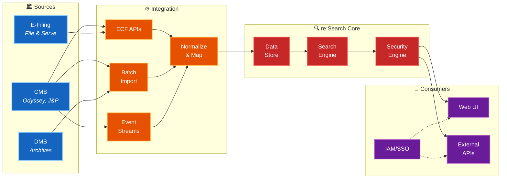

<h1 align="center" style="margin-bottom: 0;">
  re:Search Documentation
</h1>

  Comprehensive Client, Technical, API, and Integration Documentation for the re:Search Platform  
   
  Maintained by the BIS Team – Tyler Technologies

  
  
  
  

---

# Overview

re:Search is Tyler Technologies' statewide e-filing and case management integration platform, connecting courts, case management systems (CMS), and electronic filing service providers (EFSP) to enable seamless electronic filing workflows.

This repository contains all **client**, **technical**, **API**, **integration**, and **onboarding** documentation for the re:Search platform.

The content is structured for:

- CMS vendors  
- EFSP integrators  
- Court IT partners  
- Tyler BIS support analysts  
- TPMs, developers, and product teams  

Documentation is GitHub-native, uses consistent naming, and avoids vendor-specific site formats (MkDocs/Confluence).

---

# 🧭 I Am A...

**Not sure where to start?** Navigate based on your role:

- **Court IT Partner** → Start with [Integration Modes](./client-documentation/integration-modes/README.md)
- **CMS Developer** → Go to [API Reference](./technical-documentation/api-reference/README.md) + [XML Library](./technical-documentation/xml-library/README.md)
- **EFSP Integrator** → Check [Client Onboarding](./client-documentation/onboarding/README.md)
- **Tyler Support Analyst** → Jump to [Support Playbook](./technical-documentation/support-playbook/README.md)

---

# Quick Start

**Essential Documentation:**

- [Integration Modes Overview](./client-documentation/integration-modes/README.md) – Understand CIP, ECF, Batch, and Non-Integrated modes
- [API Reference](./technical-documentation/api-reference/README.md) – Full API specs for all endpoints
- [Support Playbook](./technical-documentation/support-playbook/README.md) – JCIT rules, troubleshooting, and system behavior
- [XML Library](./technical-documentation/xml-library/README.md) – Canonical XML examples for all operations

---

# 🏗️ Architecture Overview

---

# Client Documentation

| Section | Description |
|--------|-------------|
| [Integration Modes](./client-documentation/integration-modes/README.md) | Overview of CIP, ECF, Batch, and Non-Integrated modes |
| [Client Onboarding](./client-documentation/onboarding/README.md) | Full onboarding lifecycle from environment access to go-live |

---

# Technical Documentation

| Section | Description |
|--------|-------------|
| [API Reference](./technical-documentation/api-reference/README.md) | All core APIs: NotifyCaseEvent, NotifyDocketingComplete, GetCase, GetDocument, RecordFiling |
| [Support Playbook](./technical-documentation/support-playbook/README.md) | JCIT roles, security logic, event type routing, troubleshooting guides |
| [XML Library](./technical-documentation/xml-library/README.md) | Canonical XML samples for all message types |

---

# 🆘 Common Issues & FAQs

**Quick troubleshooting links:**

- [Why is my NotifyCaseEvent failing?](./technical-documentation/support-playbook/troubleshooting.md#nce-failures)
- [How do I handle security/sealed cases?](./technical-documentation/support-playbook/security_logic.md)
- [What's the difference between CIP and ECF mode?](./client-documentation/integration-modes/README.md)
- [Common CMS integration mistakes](./technical-documentation/support-playbook/common-cms-mistakes.md)
- [RecordFiling validation errors](./technical-documentation/api-reference/recordfiling/behavior-guide.md)

---

# 📋 Recent Updates

- **2025-01-15**: Added RecordFiling behavior guide with edge case handling
- **2024-12-10**: Updated security logic documentation with sealed case workflows
- **2024-11-20**: New XML examples for document filing events and party attorney updates

---

# Contribution Standards

When contributing to this repository:

- Use lowercase-dashed filenames (e.g., `case-type-mismatch.md`)
- Use `README.md` for directory indexes  
- Use Mermaid or placeholders for diagrams  
- Keep link paths relative  
- Pull requests must include:
  - Clear description of changes
  - Affected documentation sections
  - Reason for update (bug fix, enhancement, new feature)

---

# 📞 Support & Contact

### Internal Tyler Team
**BIS Team – Bryce Beltran**  
📧 bryce.beltran@tylertech.com

### External Partners
For integration support, contact your assigned Technical Project Manager or submit a support request through the Tyler Partner Portal.

### Emergency Escalation
**Production outages:** Contact your TPM immediately or escalate through standard support channels

---

# License

© 2025 Tyler Technologies. Internal use only. Do not distribute without authorization.

---

  <strong>Built with ❤️ by the BIS Team</strong>

