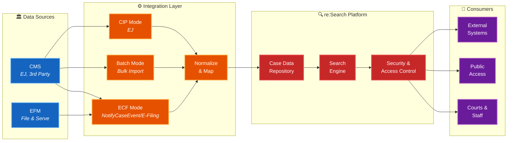

# re:Search Documentation

**Official integration documentation for Tyler Technologies' re:Search platform**

<p>
  
  
  
</p>

---

## What is re:Search?

re:Search is Tyler's centralized repository for case and document data. It integrates with court Case Management Systems (CMS) to make filings, events, and case information accessible through a web-based interface.

**This documentation is for:**
- CMS vendors integrating with re:Search
- Court IT partners implementing re:Search solutions

---

## Quick Start

**New to re:Search?** Start here:

1. **[Getting Started →](./getting-started/README.md)**  
   Understand re:Search fundamentals, architecture, and key concepts

2. **[Integration Guide →](./integration-guide/README.md)**  
   Follow the onboarding process and choose your integration mode

3. **[API Reference →](./api-reference/README.md)**  
   Explore endpoints, authentication, and XML examples

4. **[Market Standards →](./market-standards/README.md)**  
   Review market-specific requirements (Texas JCIT, Illinois AOIC, etc.)

---

## Documentation Structure
```
├── getting-started/          Foundational concepts and platform overview
├── integration-guide/        Onboarding steps and integration patterns
├── api-reference/            Complete API documentation with examples
├── market-standards/         Market-specific rules (Texas, Illinois, etc.)
├── troubleshooting/          Common issues and solutions
└── implementation-playbook/  Architecture patterns and best practices
```

### Navigation by Role

**CMS Developer**  
→ [Getting Started](./getting-started/README.md) → [API Reference](./api-reference/README.md) → [Your Market Standards](./market-standards/README.md)

**Court IT Partner**  
→ [Getting Started](./getting-started/README.md) → [Integration Guide](./integration-guide/README.md) → [Your Market Standards](./market-standards/README.md)

---

## Core Documentation

### [Getting Started](./getting-started/README.md)
Essential reading for all integrators
- Platform overview and architecture
- How re:Search works
- Glossary of terms
- Quick start guide

### [Integration Guide](./integration-guide/README.md)
Step-by-step integration process
- [Onboarding process](./integration-guide/onboarding/README.md) (environment access, testing, certification)
- [Integration modes](./integration-guide/integration-modes/README.md) (ECF, CIP, Batch, Non-Integrated)

### [API Reference](./api-reference/README.md)
Complete technical reference
- [GetCase](./api-reference/getcase/README.md) - Retrieve case data
- [GetDocument](./api-reference/getdocument/README.md) - Retrieve documents
- [NotifyCaseEvent](./api-reference/notifycaseevent/README.md) - Send case updates
- [RecordFiling](./api-reference/recordfiling/README.md) - Submit e-filings
- [NotifyDocketingComplete](./api-reference/notifydocketingcomplete/README.md) - Docketing callbacks
- [Authentication & Headers](./api-reference/authentication.md)
- [Error Codes](./api-reference/error-codes.md)

### [Market Standards](./market-standards/README.md)
Market-specific requirements and rules
- [Texas (JCIT)](./market-standards/texas/README.md) - Case types, event types, security rules
- [Illinois (AOIC)](./market-standards/illinois/README.md) - Case types, event types, security rules
- [Other Markets](./market-standards/other-markets/README.md)

### [Troubleshooting](./troubleshooting/README.md)
Common issues and solutions
- Integration issues
- Authentication errors
- Event handling problems
- Performance optimization
- Escalation process

### [Implementation Playbook](./implementation-playbook/README.md)
Deep-dive technical guidance
- Architecture patterns
- Event processing logic
- Security implementation
- Best practices and common mistakes

---

## Architecture Overview


re:Search acts as a centralized repository for case data, normalizing information from multiple sources and providing standardized APIs for consumers.

**Key Integration Points:**
- **CMS → re:Search**: NotifyCaseEvent, RecordFiling
- **re:Search → CMS**: NotifyDocketingComplete, GetCase, GetDocument

---

## Common Questions

**Which integration mode should I use?**  
See [Integration Modes Overview](./integration-guide/integration-modes/README.md)

**What case types does my market support?**  
Check [Market Standards](./market-standards/README.md) for your jurisdiction

**How do I handle sealed/confidential cases?**  
Review your market's [Security Requirements](./market-standards/README.md) and the [Implementation Playbook](./implementation-playbook/security-logic.md)

**Where do I find XML examples?**  
Each API endpoint includes annotated examples in its `/examples/` folder

**What if I encounter an integration issue?**  
Start with [Troubleshooting](./troubleshooting/README.md), then follow the [Escalation Process](./troubleshooting/escalation-process.md)

---

## Support

**Technical Support:**  
Contact your assigned Tyler Technical Project Manager (TPM)

**Documentation Issues:**  
Submit feedback through your TPM or via the Tyler Partner Portal

**Emergency Escalation:**  
For production outages, contact your TPM immediately

---

## Updates

This documentation is actively maintained by Tyler Technologies' Business Integration Services (BIS) team.

**Recent Changes:**
- 2025-01-XX: Restructured documentation with client-focused navigation
- 2025-01-XX: Consolidated market-specific standards
- 2025-01-XX: Enhanced API reference with implementation guides

---

**© 2025 Tyler Technologies, Inc. All rights reserved.**