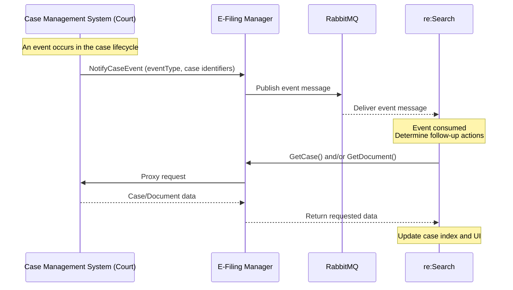
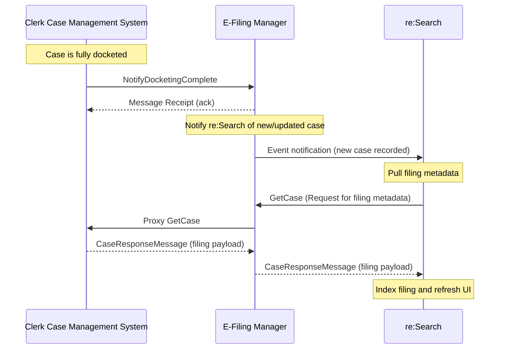
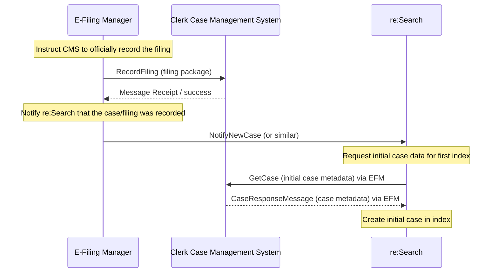

# GetCase

**Navigation:**  
[Home](../../../README.md) › [Technical Documentation](../../README.md) › [API Reference](../README.md) › GetCase

GetCase returns authoritative case metadata, including filings, parties, attorneys, docket entries, and security.  
re:Search evaluates only the XML elements relevant to the EventType that triggered the lookup.

---

## Purpose

GetCase provides the complete, authoritative CMS dataset so re:Search can:

- Reindex case details  
- Render accurate UI information  
- Evaluate security and visibility  
- Update filings, parties, documents, and metadata  

---

## Transport and Protocol

| Property | Value |
|---------|--------|
| Direction | re:Search → CMS |
| Protocol | SOAP 1.2 over HTTPS |
| Security | Mutual TLS |
| Standard | OASIS ECF |
| Message Type | GetCaseRequest / GetCaseResponse |

Authentication details:  
[Common Headers & Auth](../common-headers-and-auth.md)

---

## When This API Is Used

GetCase is called immediately after:

- A NotifyCaseEvent is received  
- A NotifyDocketingComplete is processed  
- A system-wide reindex operation is triggered  

---

## Behavior Summary

re:Search:

- Calls GetCase with the CaseTrackingID and CourtIdentifier  
- Receives the full case dataset  
- Processes only the XML sections relevant to the originating EventType  
- Updates search indexes and UI accordingly  

Incorrect or incomplete GetCaseResponse often results in:

- Visibility mismatches  
- Missing filings  
- Incorrect security  

---
## Processing Workflow

### NotifyCaseEvent Trigger (ECF mode)

---
### NotifyDocketingComplete Trigger (ECF mode)

---
### RecordFiling Trigger (ECF mode)

---


## XML Example
```xml
<soapenv:Envelope xmlns:soapenv="http://schemas.xmlsoap.org/soap/envelope/"
                  xmlns:ecf="urn:oasis:names:tc:legalxml-courtfiling:wsdl:WebServiceMessagingProfile-Definitions-4.0"
                  xmlns:tyler="urn:tyler:ecf:extensions:GetCaseMessage"
                  xmlns:nc="http://niem.gov/niem/niem-core/2.0">
  <soapenv:Header/>
  <soapenv:Body>
    <ecf:GetCaseRequest>
      <tyler:GetCaseRequestMessage>

        <!-- [REQUIRED] unique per request -->
        <tyler:MessageID>0f1c68b3-8a55-4f7c-a41a-123456789abc</tyler:MessageID>

        <!-- [REQUIRED] UTC -->
        <tyler:RequestDateTime>2025-11-11T10:30:00Z</tyler:RequestDateTime>

        <!-- [REQUIRED] mapped court/jurisdiction -->
        <tyler:CourtIdentification>
          <nc:IdentificationID>Hopkins:cc</nc:IdentificationID>
        </tyler:CourtIdentification>

        <!-- [REQUIRED] authoritative CMS case id -->
        <tyler:CaseTrackingID>CASE-12345678</tyler:CaseTrackingID>

        <!-- [OPTIONAL][RECOMMENDED] include doc metadata for Document correlation -->
        <tyler:IncludeDocumentMetadata>true</tyler:IncludeDocumentMetadata>

        <!-- [OPTIONAL][RECOMMENDED] include parties/attorneys -->
        <tyler:IncludePartyInformation>true</tyler:IncludePartyInformation>

        <!-- [NEW][OPTIONAL] return only changes since timestamp (if supported by your CMS) -->
        <!-- <tyler:SinceDateTime>2025-10-01T00:00:00Z</tyler:SinceDateTime> -->

      </tyler:GetCaseRequestMessage>
    </ecf:GetCaseRequest>
  </soapenv:Body>
</soapenv:Envelope>
```

---

## Example XML Files

| File | Description |
|------|-------------|
| [getcase-request-annotated.xml](./examples/getcase-request-annotated.xml) | Annotated request |
| [getcase-response-annotated.xml](./examples/getcase-response-annotated.xml) | Annotated response |
| [getcase-request-withpartiesanddocuments.xml](./examples/getcase-request-withpartiesanddocuments.xml) | Request with full detail |
| [getcase-request-partys.xml](./examples/getcase-request-partys.xml) | Party-only request |

---

## Related API Pages

- [RecordFiling](../recordfiling/README.md)  
- [NotifyDocketingComplete](../notifydocketingcomplete/README.md)  
- [NotifyCaseEvent](../notifycaseevent/README.md)  
- [GetDocument](../getdocument/README.md)  

---

## Related Topics

- [Security Logic](../../support-playbook/security-logic.md)
- [Registered User Matrix](../../support-playbook/registered-user-matrix.md)
- [Troubleshooting Guide](../../support-playbook/troubleshooting.md)
- [Full XML Library](../../xml-library/xml-library.md)