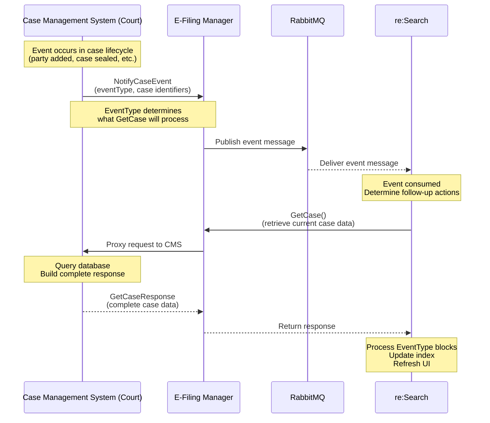
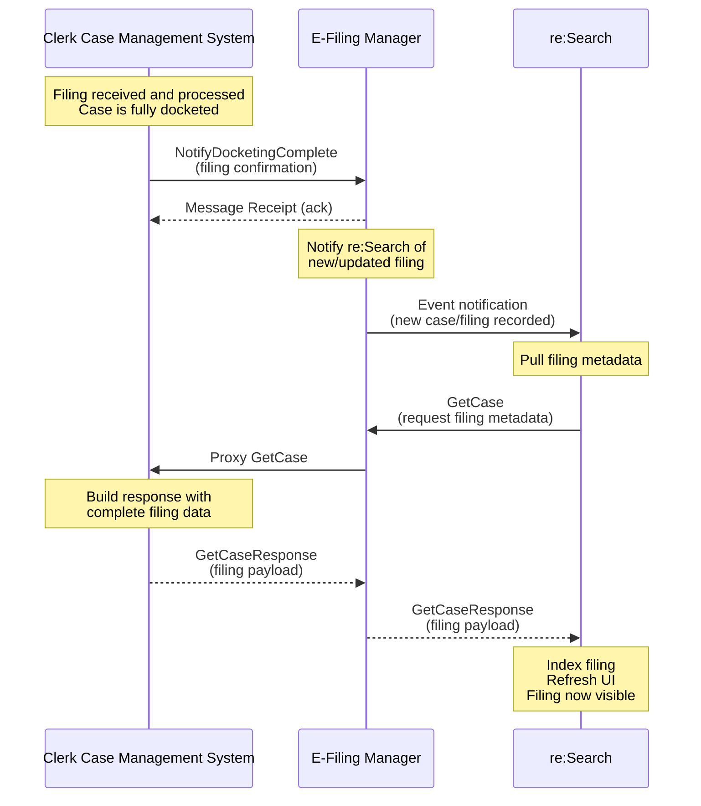
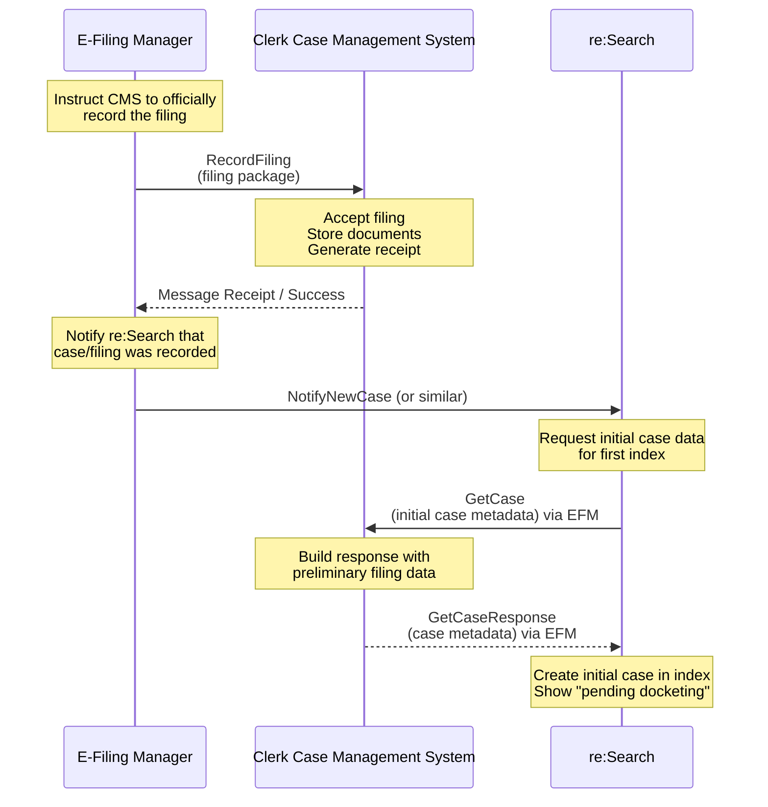

# GetCase Workflows

[← Back to GetCase Overview](./README.md)

This page shows how GetCase fits into different integration workflows. Understanding these patterns helps you see when and why GetCase is called.

## Quick Navigation
- [NotifyCaseEvent Trigger](#notifycaseevent-trigger-ecf-mode)
- [NotifyDocketingComplete Trigger](#notifydocketingcomplete-trigger-ecf-mode)
- [RecordFiling Trigger](#recordfiling-trigger-ecf-mode)
- [Batch Mode Pattern](#batch-mode-pattern)
- [Common Patterns](#common-patterns)

---

## NotifyCaseEvent Trigger (ECF Mode)

### When This Happens
- Any case change occurs in CMS (party added, case sealed, disposition entered, etc.)
- CMS sends NotifyCaseEvent to notify re:Search
- re:Search responds by calling GetCase to retrieve current data

### Complete Flow



### Step-by-Step

**1. Event Occurs in CMS**
- Example: Clerk adds new party to case
- Example: Judge seals case
- Example: Disposition entered

**2. CMS Sends NotifyCaseEvent**
```xml
<NotifyCaseEvent>
  <CaseTrackingID>CV-2024-00123</CaseTrackingID>
  <EventType>CaseParty</EventType>
</NotifyCaseEvent>
```

**3. Event Routed Through EFM and Message Queue**
- EFM receives event
- Publishes to RabbitMQ
- re:Search consumes from queue

**4. re:Search Calls GetCase**
```xml
<GetCaseRequest>
  <CaseTrackingID>CV-2024-00123</CaseTrackingID>
  <IncludePartyInformation>true</IncludePartyInformation>
</GetCaseRequest>
```

**5. CMS Returns Complete Case Data**
- Queries database for current state
- Builds complete response (not just changed party)
- Returns to re:Search via EFM

**6. re:Search Processes Response**
- Processes only CaseParty blocks (because EventType=CaseParty)
- Ignores filings, documents, etc.
- Updates party list in index
- Refreshes UI

### Timing
- **Event to GetCase:** < 5 seconds typical
- **GetCase response:** < 3 seconds
- **Total latency:** < 10 seconds (event to visible in UI)

---

## NotifyDocketingComplete Trigger (ECF Mode)

### When This Happens
- Filing submitted through e-filing system
- CMS receives filing via RecordFiling
- CMS dockets the filing
- CMS sends NotifyDocketingComplete to confirm
- re:Search calls GetCase to retrieve docketed filing

### Complete Flow



### Step-by-Step

**1. Filing Docketed in CMS**
- Clerk reviews and approves filing
- Filing assigned docket number/sequence
- Document officially added to case record

**2. CMS Sends NotifyDocketingComplete**
```xml
<NotifyDocketingComplete>
  <CaseTrackingID>CV-2024-00123</CaseTrackingID>
  <FilingID>FIL-789</FilingID>
  <DocketingStatus>Success</DocketingStatus>
</NotifyDocketingComplete>
```

**3. EFM Notifies re:Search**
- EFM forwards docketing confirmation
- Triggers re:Search to refresh case

**4. re:Search Calls GetCase**
```xml
<GetCaseRequest>
  <CaseTrackingID>CV-2024-00123</CaseTrackingID>
  <IncludeDocumentMetadata>true</IncludeDocumentMetadata>
</GetCaseRequest>
```

**5. CMS Returns Filing Data**
- Includes complete FilingEvent
- Document metadata with CMSIDs
- ActivityDate for timeline
- PageCount for documents

**6. re:Search Indexes Filing**
- Processes FilingEvent blocks
- Links documents to filing
- Updates timeline
- Filing visible in UI

### Why Two GetCase Calls for E-Filing?

Some implementations call GetCase twice during e-filing:

1. **Pre-Docket GetCase:** After RecordFiling accepted
   - Captures that filing was received
   - Shows "pending docketing" status

2. **Post-Docket GetCase:** After NotifyDocketingComplete
   - Retrieves fully docketed filing
   - Shows official docket entry

**This is optional** - many implementations only do post-docket GetCase.

---

## RecordFiling Trigger (ECF Mode)

### When This Happens
- Filing submitted through EFSP (e-filing service provider)
- EFM validates and routes to CMS
- CMS records filing via RecordFiling API
- re:Search may call GetCase for initial case data

### Complete Flow



### Step-by-Step

**1. EFM Sends RecordFiling to CMS**
- Filing package with documents
- Filing metadata
- Payment information

**2. CMS Records Filing**
- Validates filing package
- Stores documents
- Creates preliminary case record
- Returns receipt to EFM

**3. EFM Notifies re:Search**
- Sends notification that filing recorded
- May include filing identifiers

**4. re:Search Calls GetCase**
- Retrieves initial case data
- May show "pending docketing" status

**5. Later: NotifyDocketingComplete**
- CMS dockets filing
- Sends NotifyDocketingComplete
- re:Search calls GetCase again for final data

---

## Batch Mode Pattern

### When This Happens
Batch Mode doesn't use GetCase - it uses file-based delivery instead.

### Conceptual Comparison

**ECF Mode (Real-time):**
```
Event → NotifyCaseEvent → GetCase → Index
```

**Batch Mode (Scheduled):**
```
Scheduled export → File upload → Batch processing → Index
```

**Batch Mode replaces:**
- NotifyCaseEvent → File manifest
- GetCase → JSON Lines data files
- Real-time → Scheduled (hourly/nightly)

[Learn more about Batch Mode →](../../integration-modes/batch-mode/)

---

## Common Patterns

### Pattern 1: Simple Case Update

**Scenario:** Clerk adds a party to existing case

```
CMS: Party added to CV-2024-00123
     ↓
CMS: NotifyCaseEvent(CV-2024-00123, CaseParty)
     ↓
re:Search: GetCase(CV-2024-00123)
     ↓
CMS: Returns complete case with updated party list
     ↓
re:Search: Updates party list in index
     ↓
UI: Party now visible
```

**Timeline:** ~10 seconds total

---

### Pattern 2: Security Change

**Scenario:** Judge seals a case

```
CMS: Case CV-2024-00123 sealed
     ↓
CMS: NotifyCaseEvent(CV-2024-00123, CaseSecurity) [IMMEDIATE]
     ↓
re:Search: GetCase(CV-2024-00123) [HIGH PRIORITY]
     ↓
CMS: Returns case with CaseSecurity=SealedCase
     ↓
re:Search: Updates security immediately
     ↓
UI: Case hidden from public within seconds
```

**Timeline:** ~5 seconds (prioritized)

---

### Pattern 3: E-Filing Complete Workflow

**Scenario:** Attorney files complaint through EFSP

```
Attorney: Submit filing via EFSP
     ↓
EFM: Validate and route
     ↓
CMS: RecordFiling received
     ↓
CMS: Accept filing, store documents
     ↓
EFM → re:Search: Notify filing recorded
     ↓
re:Search: GetCase (preliminary data)
     ↓
UI: Filing shows "pending docketing"
     
[TIME PASSES - clerk reviews]
     
CMS: Docket filing
     ↓
CMS: NotifyDocketingComplete
     ↓
EFM → re:Search: Notify docketed
     ↓
re:Search: GetCase (final data)
     ↓
UI: Filing shows as officially docketed
```

**Timeline:** Minutes to hours (depends on clerk review)

---

### Pattern 4: Multiple Simultaneous Changes

**Scenario:** Clerk makes multiple changes at once

**Option A: Multiple Events**
```
CMS: Party added + Filing added + Disposition entered
     ↓
CMS: NotifyCaseEvent(CaseParty)
CMS: NotifyCaseEvent(CaseFiling)
CMS: NotifyCaseEvent(CaseDisposition)
     ↓
re:Search: GetCase (called 3 times)
     ↓
re:Search: Processes each EventType separately
```

**Option B: Single CaseInitiated Event**
```
CMS: Multiple changes made
     ↓
CMS: NotifyCaseEvent(CaseInitiated)
     ↓
re:Search: GetCase (called once)
     ↓
re:Search: Processes entire case (all blocks)
```

**Recommendation:** Use CaseInitiated for bulk changes to avoid multiple GetCase calls.

---

### Pattern 5: Error Recovery

**Scenario:** GetCase fails, needs retry

```
CMS: NotifyCaseEvent sent
     ↓
re:Search: GetCase (attempt 1)
     ↓
CMS: Timeout or error
     ↓
re:Search: Wait 30 seconds
     ↓
re:Search: GetCase (attempt 2)
     ↓
CMS: Success
     ↓
re:Search: Index update
```

**Retry logic:**
- Attempt 1: Immediate
- Attempt 2: +30 seconds
- Attempt 3: +60 seconds
- After 3 failures: Alert operations

---

## Performance Considerations

### GetCase Call Frequency

**Typical court (500 e-filings/month):**
- ~1,000 NotifyCaseEvent per month
- ~2,000 GetCase calls per month
- Peak: 10-20 calls per minute

**Large court (5,000 e-filings/month):**
- ~10,000 NotifyCaseEvent per month
- ~20,000 GetCase calls per month
- Peak: 50-100 calls per minute

### Optimization Tips

**Reduce GetCase Calls:**
- Use CaseInitiated for bulk changes (1 call vs. many)
- Don't send duplicate events for same change
- Batch multiple changes when possible

**Improve GetCase Performance:**
- Optimize database queries (avoid N+1)
- Add indexes on case_tracking_id
- Don't cache responses (must be current)
- Test with production-sized cases

---

## Testing Workflows

### Must Test These Scenarios

**1. Simple Update Flow**
- Send NotifyCaseEvent
- Verify GetCase called
- Verify update appears in UI

**2. E-Filing Flow**
- Submit filing via EFSP
- Verify RecordFiling received
- Verify NotifyDocketingComplete sent
- Verify both GetCase calls
- Verify filing visible in UI

**3. Security Change Flow**
- Send CaseSecurity event
- Verify GetCase called immediately
- Verify case hidden within seconds

**4. Multiple Events Flow**
- Send 3 different EventTypes
- Verify 3 separate GetCase calls
- Verify all updates process correctly

**5. Error Recovery Flow**
- Simulate GetCase timeout
- Verify retry logic
- Verify eventual success

---

## Troubleshooting Workflows

### GetCase Not Called

**Symptom:** NotifyCaseEvent sent but GetCase never called

**Check:**
1. Event reached re:Search? (Check EFM logs)
2. EventType valid? (Must be recognized type)
3. CaseTrackingID valid? (Must exist)
4. Message queue working? (Check RabbitMQ)

### GetCase Times Out

**Symptom:** re:Search calls GetCase but CMS doesn't respond in time

**Check:**
1. CMS database query performance
2. Network connectivity
3. CMS server load
4. Response size (too large?)

### Updates Don't Appear

**Symptom:** GetCase succeeds but UI doesn't update

**Check:**
1. EventType matches blocks in response?
2. Required fields present (ActivityDate, CMSIDs)?
3. Security settings correct?
4. Response fully parsed without errors?

---

## Next Steps

- **Understand behavior rules** → Read [Behavior Guide](./behavior-guide.md)
- **Review request/response format** → Read [Request & Response Specification](./request-response.md)
- **Return to overview** → [GetCase Overview](./README.md)

---

**Last Updated:** December 2025