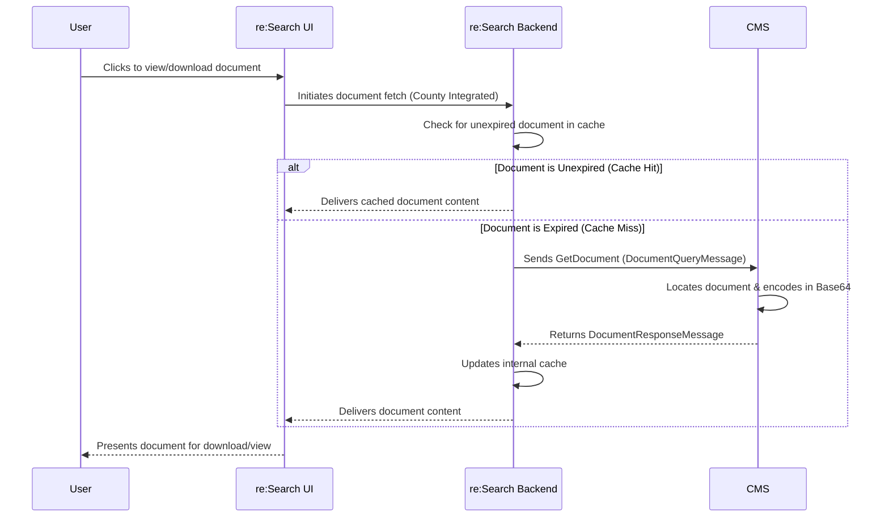
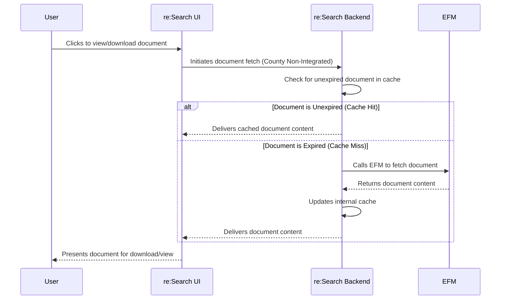
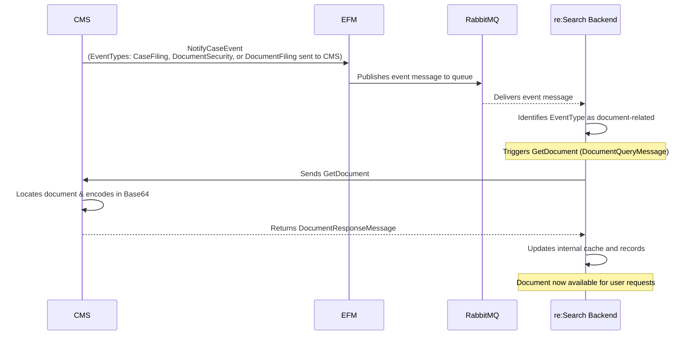

# GetDocument Workflows

[← Back to GetDocument Overview](./README.md)

This page shows when and how GetDocument is called in different scenarios.

## Quick Navigation
- [User-Triggered Retrieval](#user-triggered-retrieval)
- [Event-Triggered Retrieval](#event-triggered-retrieval)
- [Caching Behavior](#caching-behavior)
- [Performance Considerations](#performance-considerations)
- [Troubleshooting](#troubleshooting)

---

## User-Triggered Retrieval

### Integrated County Flow

**When:** User clicks to view/download document in re:Search UI



**Step-by-step:**
1. User clicks document link in re:Search UI
2. re:Search checks if document cached and unexpired
3. If cached → Return immediately
4. If not cached or expired → Call GetDocument API to CMS
5. CMS locates document, encodes Base64, returns
6. re:Search caches document and delivers to user

**Timing:** < 2 seconds typical (cached), < 5 seconds (CMS call)

---

### Non-Integrated County Flow

**When:** User clicks document in non-integrated county



**Key difference:** re:Search calls EFM instead of CMS directly.

---

## Event-Triggered Retrieval

### NotifyCaseEvent Triggers

**When:** CMS sends NotifyCaseEvent with document-related EventTypes



**EventTypes that trigger GetDocument:**
- **CaseFiling** - New filing added, retrieve filing documents
- **DocumentSecurity** - Document security changed, refresh document
- **DocumentFiling** - Document filed (non-e-filing), retrieve document

**Purpose:** Proactive caching to ensure documents available when users need them

---

## Caching Behavior

### Cache Strategy

**re:Search caches documents** to minimize calls to CMS and improve performance.

| Aspect | Behavior |
|--------|----------|
| **Duration** | Configurable (typically 30-90 days) |
| **When cached** | After successful GetDocument call |
| **When invalidated** | DocumentSecurity event or manual purge |
| **Cache key** | Document CMSID |

### Cache Decision Flow

```
User requests document
    ↓
Is document in cache?
├─ YES → Is cache entry expired?
│         ├─ NO → Return cached document
│         └─ YES → Call GetDocument, update cache
│
└─ NO → Call GetDocument, store in cache
```

### Cache Invalidation

**Triggers for cache refresh:**
1. **DocumentSecurity event** - Security changed, must refresh
2. **Cache expiration** - TTL expired (30-90 days)
3. **Manual purge** - Admin-triggered cache clear

**CMS should always return current document** - don't rely on re:Search cache being current.

---

## Performance Considerations

### Response Time Targets

| Scenario | Target | Maximum | Notes |
|----------|--------|---------|-------|
| **Cache hit** | < 100 ms | < 500 ms | Serving from re:Search cache |
| **Small file (< 1 MB)** | < 1 second | < 2 seconds | GetDocument call to CMS |
| **Medium file (1-10 MB)** | < 2 seconds | < 5 seconds | GetDocument call to CMS |
| **Large file (10-50 MB)** | < 5 seconds | < 10 seconds | GetDocument call to CMS |

### CMS Performance Tips

**Database Optimization:**
```sql
-- Index on document CMSID for fast lookup
CREATE INDEX idx_document_cmsid ON documents(cms_id);

-- Include file path in index for covering query
CREATE INDEX idx_document_file ON documents(cms_id, file_path);
```

**File Retrieval:**
- Store files on fast storage (SSD preferred)
- Use file path indexing in database
- Consider CDN for frequently accessed documents
- Stream large files instead of loading entirely into memory

**Base64 Encoding:**
- Use efficient encoding libraries
- Stream encoding for large files
- Don't encode in database query (encode in application)

### API Call Frequency

**Typical court (500 e-filings/month):**
- ~1,000 user-triggered GetDocument calls/month
- ~500 event-triggered calls/month
- Cache hit rate: 70-80%
- Actual CMS calls: ~300-450/month

**Large court (5,000 e-filings/month):**
- ~10,000 user-triggered calls/month
- ~5,000 event-triggered calls/month
- Cache hit rate: 75-85%
- Actual CMS calls: ~2,250-3,750/month

---

## Integration Points

### Where GetDocument Fits

**1. User Document View:**
```
User clicks document → re:Search UI → GetDocument → Display PDF
```

**2. E-Filing Workflow:**
```
Filing docketed → NotifyCaseEvent(CaseFiling) → GetDocument → Cache
```

**3. Security Change:**
```
Document sealed → NotifyCaseEvent(DocumentSecurity) → GetDocument → Refresh cache
```

**4. Batch Indexing:**
```
Background job → Validate docs exist → GetDocument for missing → Update cache
```

---

## Common Integration Patterns

### Pattern 1: First-Time Document Access

```
User searches for case (first time)
    ↓
User clicks document link
    ↓
re:Search: No cache entry exists
    ↓
re:Search calls GetDocument
    ↓
CMS retrieves file, encodes Base64, returns
    ↓
re:Search caches document
    ↓
User views document
```

**Timeline:** 2-5 seconds (includes CMS call)

---

### Pattern 2: Subsequent Access (Cached)

```
User searches for case (return visit)
    ↓
User clicks document link
    ↓
re:Search: Cache entry exists and unexpired
    ↓
re:Search returns cached document
    ↓
User views document
```

**Timeline:** < 500 ms (no CMS call)

---

### Pattern 3: Security Change Invalidates Cache

```
Clerk seals document in CMS
    ↓
CMS sends NotifyCaseEvent(DocumentSecurity)
    ↓
re:Search receives event
    ↓
re:Search calls GetDocument (refresh)
    ↓
CMS enforces security, returns error or restricted content
    ↓
re:Search updates cache with new security
    ↓
Public users can no longer access
```

**Timeline:** Minutes (event processing + cache refresh)

---

## Troubleshooting

### Document Not Loading

**Symptom:** User clicks document, gets "Document unavailable" error

**Possible causes:**
1. Document file missing from CMS storage
2. CMSID mismatch between GetCase and GetDocument
3. GetDocument timeout (> 5 seconds)
4. Security blocking access
5. Base64 encoding error

**Debug steps:**
1. Check CMS logs - was GetDocument called?
2. Verify document file exists in storage
3. Verify CMSID in GetCase matches GetDocument
4. Check GetDocument response time
5. Verify user authorization for document
6. Test Base64 encoding/decoding

---

### Empty Document Returned

**Symptom:** Document downloads but is 0 KB or won't open

**Possible causes:**
1. BinaryBase64Object empty in response
2. File read error (file not found)
3. Base64 encoding failed
4. Incorrect MIME type

**Debug steps:**
1. Check GetDocument response - is BinaryBase64Object populated?
2. Verify file exists at path in database
3. Test Base64 encoding manually
4. Verify file not corrupted
5. Check file permissions

---

### Timeout Errors

**Symptom:** GetDocument call times out (> 5 seconds)

**Possible causes:**
1. Large file size (> 50 MB)
2. Slow database query
3. Network latency
4. File storage slow
5. Base64 encoding slow

**Debug steps:**
1. Check file size - is it > 10 MB?
2. Profile database query performance
3. Check network latency to file storage
4. Test file read speed
5. Profile Base64 encoding time

**Solutions:**
- Add database indexes on CMSID
- Move files to faster storage
- Implement streaming for large files
- Use faster Base64 encoding library

---

### Security Errors (403)

**Symptom:** GetDocument returns 403 Forbidden

**Possible causes:**
1. Case is sealed and user not authorized
2. Document has RestrictedView or NoAccess security
3. User not attorney of record
4. Security check logic error

**Debug steps:**
1. Verify case security settings
2. Verify document security settings
3. Check user role
4. For attorneys - verify attorney of record
5. Review security enforcement logic

---

### Wrong Document Returned

**Symptom:** User gets different document than expected

**Possible causes:**
1. CMSID collision (duplicate IDs)
2. Database query error
3. Cache corruption

**Debug steps:**
1. Verify CMSID uniqueness in database
2. Check database query joins
3. Clear cache and test again
4. Verify file path mapping

---

## Testing Scenarios

### Must Test Successfully

**1. User Document Retrieval**
- User clicks document
- Verify GetDocument called (if not cached)
- Verify document delivered correctly
- Verify correct MIME type

**2. Caching**
- First access calls GetDocument
- Second access uses cache (no GetDocument call)
- Cache expires after TTL
- Next access calls GetDocument again

**3. Security Enforcement**
- Public user can access public documents
- Public user cannot access sealed documents
- Attorney can access restricted docs in their cases
- Court staff can access all documents

**4. Event-Triggered Retrieval**
- CaseFiling event triggers GetDocument
- DocumentSecurity event triggers GetDocument
- Document cached after event processing

**5. Error Handling**
- Missing document returns 404
- Access denied returns 403
- Timeout handled gracefully
- Empty file handled correctly

**6. Performance**
- Small files (< 1 MB) return in < 2 seconds
- Large files (< 10 MB) return in < 5 seconds
- Cache hits return in < 500 ms

---

## Best Practices Summary

### DO:
✅ Always enforce security in GetDocument
✅ Return Base64-encoded binary content
✅ Check file exists before attempting read
✅ Handle missing files with 404 error
✅ Return access denied with 403 error
✅ Log all GetDocument requests
✅ Test with various file sizes
✅ Implement timeout handling (5s max)
✅ Use streaming for large files
✅ Validate CMSIDs match GetCase response

### DON'T:
❌ Return empty BinaryBase64Object (return error)
❌ Skip security checks for "public" documents
❌ Cache document content in CMS
❌ Return documents without authorization
❌ Assume GetCase security is always current
❌ Load entire large file into memory
❌ Return generic errors without details
❌ Expose internal file paths in errors

---

## Next Steps

- **Understand security enforcement** → Read [Security Guide](./security-guide.md)
- **Review request format** → Read [Request & Response Specification](./request-response.md)
- **Return to overview** → [GetDocument Overview](./README.md)

---

**Last Updated:** December 2025