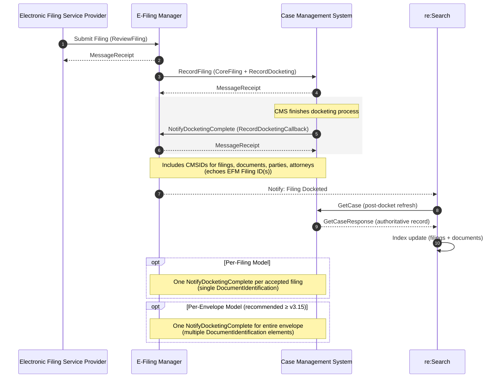

# NotifyCaseEvent

**Navigation:**  
[Home](../../../README.md) › [Technical Documentation](../../README.md) › [API Reference](../README.md) › NotifyCaseEvent

NotifyCaseEvent (NCE) is used by the CMS to notify re:SearchTX that case data has changed.  
Each message includes an `eventType` telling re:Search exactly which category of update occurred and which sections of the subsequent GetCaseResponse should be evaluated.

re:Search **only processes XML elements that correspond to the declared `eventType`**.
---
## Purpose

NotifyCaseEvent allows CMS systems to:

- Trigger synchronization when case data changes  
- Indicate which parts of the case were modified  
- Keep re:Search data aligned with the CMS  
- Maintain visibility, security, and classification parity  

---

## Transport and Protocol

| Property | Value |
|---------|--------|
| Direction | CMS → re:Search |
| Protocol | SOAP 1.2 over HTTPS |
| Security | Mutual TLS |
| Standard | OASIS ECF |
| Message Type | NotifyCaseEventMessage |

Authentication details:  
[Common Headers & Auth](../common-headers-and-auth.md)

---

## Supported Event Types

See full details in:  
[EventType Logic](../../support-playbook/eventtype-logic.md)

| EventType | Description |
|-----------|-------------|
| CaseFiling | Filing or docket update |
| CaseParty | Party additions/changes |
| CasePartyAttorney | Attorney assignment changes |
| CaseReassigned | Judge/court/location changes |
| CaseDisposition | Disposition updates |
| CaseSecurity | Sealed/unsealed/confidential/public |
| DocumentSecurity | Individual document visibility |
| CaseDelete | Case marked deleted/restored |
| CaseExpunge | Case restricted/expunged |

---
## Processing Workflow



### Overview

1. **CMS modifies case data.**  
2. **CMS sends NotifyCaseEvent** with the correct `eventType`.  
3. **re:Search calls GetCase** to retrieve the updated full case dataset.  
4. **Selective evaluation occurs**:  
   Only the parts of the GetCaseResponse relevant to the `eventType` are processed.  
5. **Index/UI updates** are applied in the re:Search portal.

Incorrect `eventType` → incorrect evaluation → incorrect visibility.

---

## Example XML Files

| File | Description |
|------|-------------|
| [case-delete.xml](./examples/case-delete.xml) | CaseDelete event sample |
| [case-disposition.xml](./examples/case-disposition.xml) | CaseDisposition sample |
| [case-expunge.xml](./examples/case-expunge.xml) | CaseExpunge sample |
| [case-filing.xml](./examples/case-filing.xml) | CaseFiling sample |
| [case-party.xml](./examples/case-party.xml) | CaseParty sample |
| [case-party-attorney.xml](./examples/case-party-attorney.xml) | CasePartyAttorney sample |
| [case-reassigned.xml](./examples/case-reassigned.xml) | Judge/court/location reassignment |
| [case-security.xml](./examples/case-security.xml) | CaseSecurity update |
| [document-filing.xml](./examples/document-filing.xml) | DocumentFiling sample |
| [document-security.xml](./examples/document-security.xml) | DocumentSecurity update |
| [generic-example.xml](./examples/generic-example.xml) | Generic example |

### XML Example

#### Example Message (annotated)

```xml
<!-- SOAP Body: Contains the actual web service message payload -->
<soapenv:Body xmlns:xsi="http://www.w3.org/2001/XMLSchema-instance" xmlns:xsd="http://www.w3.org/2001/XMLSchema">
   <!-- Web Service Operation: The main service method being called for case event notifications -->
   <NotifyCaseEvent xmlns="urn:oasis:names:tc:legalxml-courtfiling:wsdl:WebServiceMessagingProfile-Definitions-4.0">
      <!-- Request Wrapper: Contains the actual notification request parameters -->
      <NotifyCaseEventRequest>
         <!-- Notification Message: The core message containing case event details -->
         <NotifyCaseEventMessage xmlns="urn:tyler:ecf:extensions:CaseNotifyMessage">
            <!-- Court Information: Identifies which court/jurisdiction this case belongs to -->
            <CaseCourt xmlns="http://niem.gov/niem/domains/jxdm/4.0">
               <!-- Court Identification: Unique identifier for the court system -->
               <OrganizationIdentification xmlns="http://niem.gov/niem/niem-core/2.0">
                  <!-- Court ID: "lake" identifies the specific court (Lake County court system) -->
                  <IdentificationID>lake</IdentificationID>
                  <!-- ID Category: Not used in this message (null) -->
                  <IdentificationCategoryText xsi:nil="true"/>
                  <!-- ID Source: Not used in this message (null) -->
                  <IdentificationSourceText xsi:nil="true"/>
               </OrganizationIdentification>
               <!-- Optional Court Details: All set to null/not used in this notification -->
               <!-- Physical location of the court -->
               <OrganizationLocation xsi:nil="true" xmlns="http://niem.gov/niem/niem-core/2.0"/>
               <!-- Full name of the court organization -->
               <OrganizationName xsi:nil="true" xmlns="http://niem.gov/niem/niem-core/2.0"/>
               <!-- Primary contact information for the court -->
               <OrganizationPrimaryContactInformation xsi:nil="true" xmlns="http://niem.gov/niem/niem-core/2.0"/>
               <!-- Sub-unit within the court (e.g., specific division) -->
               <OrganizationSubUnitName xsi:nil="true" xmlns="http://niem.gov/niem/niem-core/2.0"/>
               <!-- Tax identification number for the court -->
               <OrganizationTaxIdentification xsi:nil="true" xmlns="http://niem.gov/niem/niem-core/2.0"/>
               <!-- Organizational unit name within the court -->
               <OrganizationUnitName xsi:nil="true" xmlns="http://niem.gov/niem/niem-core/2.0"/>
               <!-- Display name of the court -->
               <CourtName xsi:nil="true"/>
            </CaseCourt>
            <!-- Case Identifier: Unique tracking number for this specific case -->
            <CaseTrackingID xmlns="http://niem.gov/niem/niem-core/2.0">6172150</CaseTrackingID>
            <!-- Notification Purpose: Describes why this notification is being sent -->
            <NotificationReason>TEST</NotificationReason>
            <!-- Event Details: Information about the specific event that triggered this notification -->
            <Event>
               <!-- Event Unique ID: Internal identifier for this specific event -->
               <ID>1234567</ID>
               <!-- Event Classification: Type of event-->
               <EventType>CaseFiling</EventType>
            </Event>    
         </NotifyCaseEventMessage>
      </NotifyCaseEventRequest>
   </NotifyCaseEvent>
</soapenv:Body>
```

---

## Related API Pages

- [RecordFiling](../recordfiling/README.md)  
- [NotifyDocketingComplete](../notifydocketingcomplete/README.md)  
- [GetCase](../getcase/README.md)  
- [GetDocument](../getdocument/README.md)  

---

## Related Topics

- [EventType Logic](../../support-playbook/eventtype-logic.md)
- [Security Logic](../../support-playbook/security-logic.md)
- [Troubleshooting Guide](../../support-playbook/troubleshooting.md)
- [Full XML Library](../../xml-library/xml-library.md)