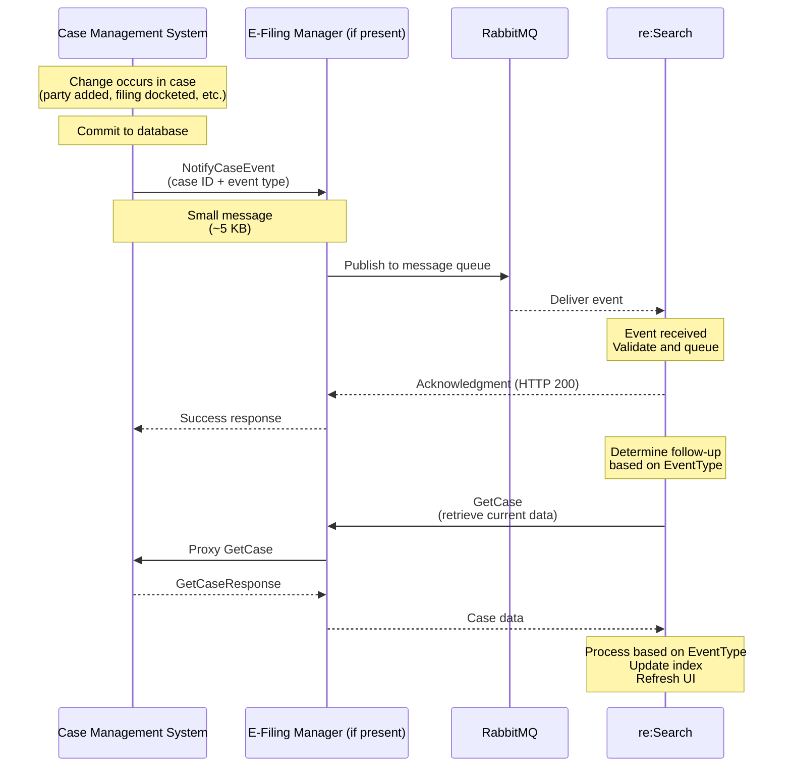

# NotifyCaseEvent Workflows

[← Back to NotifyCaseEvent Overview](./README.md)

This page shows when and how to send NotifyCaseEvent in different scenarios.

## Quick Navigation
- [Basic Flow](#basic-flow)
- [Common Patterns](#common-patterns)
- [Integration Points](#integration-points)
- [Timing and Performance](#timing-and-performance)
- [Troubleshooting](#troubleshooting)

---

## Basic Flow

### Standard Workflow



### Step-by-Step Breakdown

**1. Change Occurs in CMS**
- User action (clerk adds party, judge seals case, etc.)
- Database update performed
- **Critical:** Database transaction committed first

**2. CMS Sends NotifyCaseEvent**
- After successful commit
- Includes: court code, case ID, event type, reason
- Small message (~5 KB)

**3. Event Delivered to re:Search**
- Via EFM and RabbitMQ (if ECF mode)
- Direct to re:Search (if CIP mode)
- Acknowledged immediately (HTTP 200)

**4. re:Search Processes Event**
- Validates event
- Queues GetCase call
- Calls GetCase with appropriate parameters

**5. GetCase Retrieves Data**
- re:Search calls CMS GetCase API
- CMS returns current case state
- re:Search processes based on EventType

**6. Index Updated**
- Changes visible in re:Search UI
- Total latency: typically < 30 seconds

---

## Common Patterns

### Pattern 1: Single Change Event

**Scenario:** Clerk adds a party to existing case

```
1. Clerk adds "Jane Doe" as defendant
2. CMS commits to database
3. CMS sends:
   NotifyCaseEvent(
     CaseTrackingID="CV-2024-00123",
     EventType="CaseParty",
     Reason="Defendant Jane Doe added"
   )
4. re:Search calls GetCase
5. re:Search processes CaseParty blocks only
6. Party appears in UI
```

**Timeline:** ~10 seconds total

---

### Pattern 2: Security Change (High Priority)

**Scenario:** Judge seals a case

```
1. Judge orders case sealed
2. Clerk updates case security in CMS
3. CMS commits to database
4. CMS sends:
   NotifyCaseEvent(
     CaseTrackingID="CR-2024-00456",
     EventType="CaseSecurity",
     Reason="Case sealed per order #2024-789"
   )
   [SENT IMMEDIATELY - NOT QUEUED]
5. re:Search prioritizes security events
6. re:Search calls GetCase (high priority)
7. Case hidden from public within seconds
```

**Timeline:** ~5 seconds (prioritized)

**⚠️ Critical:** Security events must be sent synchronously, never batched or queued!

---

### Pattern 3: Multiple Related Changes

**Scenario:** Clerk makes multiple updates at once

**Option A: Multiple Events**
```
Changes:
- Party added
- Attorney assigned
- Filing docketed

Send:
1. NotifyCaseEvent(EventType="CaseParty")
2. NotifyCaseEvent(EventType="CasePartyAttorney")  
3. NotifyCaseEvent(EventType="CaseFiling")

Result:
- 3 GetCase calls
- Each processes its specific blocks
- All updates visible
```

**Option B: Single Event (Recommended)**
```
Changes:
- Party added
- Attorney assigned
- Filing docketed

Send:
1. NotifyCaseEvent(EventType="CaseInitiated")

Result:
- 1 GetCase call
- Processes entire case
- More efficient
```

**Recommendation:** Use `CaseInitiated` for bulk changes.

---

### Pattern 4: New Case Creation

**Scenario:** Brand new case filed

```
1. New case created in CMS
2. Initial party/attorney/filing added
3. CMS commits to database
4. CMS sends:
   NotifyCaseEvent(
     CaseTrackingID="CV-2024-01000",
     EventType="CaseInitiated",
     Reason="New civil case filed"
   )
5. re:Search calls GetCase
6. re:Search processes complete case
7. Case appears in public search
```

**Timeline:** ~15 seconds

---

### Pattern 5: E-Filing Workflow

**Scenario:** Attorney files document through e-filing

```
1. Attorney submits via EFSP
2. EFM validates and routes to CMS
3. CMS receives via RecordFiling
4. CMS stores filing (preliminary)
5. Clerk reviews and dockets
6. CMS updates filing status
7. CMS sends:
   NotifyCaseEvent(
     EventType="CaseFiling",
     Reason="Motion to Dismiss docketed"
   )
8. re:Search calls GetCase
9. Filing visible in re:Search UI
```

**Alternative:** Some implementations send events at RecordFiling (preliminary) AND after docketing (final).

---

## Integration Points

### Where to Hook NotifyCaseEvent

Your CMS should send NotifyCaseEvent from these locations:

**1. Party Management**
```csharp
public void AddPartyToCase(string caseId, Party party)
{
    // Update database
    _repository.AddParty(caseId, party);
    _repository.Commit();
    
    // Send event AFTER commit
    _eventService.SendNotifyCaseEvent(
        caseId, 
        EventType.CaseParty, 
        $"Party {party.Name} added");
}
```

**2. Filing Docketing**
```csharp
public void DocketFiling(string caseId, Filing filing)
{
    // Update database
    _repository.UpdateFilingStatus(filing.Id, "Docketed");
    _repository.Commit();
    
    // Send event AFTER commit
    _eventService.SendNotifyCaseEvent(
        caseId,
        EventType.CaseFiling,
        $"Filing {filing.Description} docketed");
}
```

**3. Security Changes (Synchronous)**
```csharp
public void SealCase(string caseId, string reason)
{
    // Update database
    _repository.UpdateCaseSecurity(caseId, "SealedCase");
    _repository.Commit();
    
    // Send event IMMEDIATELY (synchronous)
    _eventService.SendNotifyCaseEventSync(
        caseId,
        EventType.CaseSecurity,
        $"Case sealed: {reason}");
    
    // Don't continue until event sent!
}
```

**4. Disposition Entry**
```csharp
public void EnterDisposition(string caseId, Disposition disp)
{
    // Update database
    _repository.AddDisposition(caseId, disp);
    _repository.Commit();
    
    // Send event
    _eventService.SendNotifyCaseEvent(
        caseId,
        EventType.CaseDisposition,
        $"Disposition entered: {disp.Type}");
}
```

---

## Timing and Performance

### When to Send Events

**✅ Correct Timing:**
```
1. Begin database transaction
2. Make changes to case data
3. Commit transaction
4. Send NotifyCaseEvent ← AFTER commit
5. Return success to user
```

**❌ Incorrect Timing:**
```
1. Begin database transaction
2. Send NotifyCaseEvent ← WRONG! Before commit
3. Make changes to case data
4. Commit transaction
5. Return success to user
```

**Problem:** If transaction rolls back, event already sent pointing to non-existent change.

---

### Async vs Sync

**Most Events: Async (Recommended)**
```
CMS → Queue → Background Worker → re:Search
         ↓
    Quick return to user
```

**Benefits:**
- User doesn't wait for re:Search
- Retry logic easier
- Better performance

**Security Events: Sync (Required)**
```
CMS → re:Search (direct call)
         ↓
    Wait for acknowledgment
```

**Why:** Security changes must take effect immediately.

---

### Performance Targets

| Metric | Target | Maximum |
|--------|--------|---------|
| **Event message size** | < 5 KB | < 50 KB |
| **Event delivery time** | < 1 second | < 3 seconds |
| **GetCase triggered** | < 5 seconds after event | < 30 seconds |
| **Total latency** | < 30 seconds (change to UI) | < 2 minutes |
| **Security event latency** | < 5 seconds | < 10 seconds |

---

### Event Frequency

**Typical Court (500 e-filings/month):**
- ~1,000 events per month
- ~50 events per day
- Peak: 10-20 events per hour

**Large Court (5,000 e-filings/month):**
- ~10,000 events per month
- ~500 events per day
- Peak: 50-100 events per hour

**System Capacity:**
- Handles 1,000+ events per minute
- No throttling needed for typical usage

---

## Error Handling

### Retry Strategy

```
Attempt 1: Immediate
   ↓ (if failure)
Wait 1 second
   ↓
Attempt 2: +1s
   ↓ (if failure)
Wait 2 seconds
   ↓
Attempt 3: +2s
   ↓ (if failure)
Wait 4 seconds
   ↓
Attempt 4: +4s
   ↓ (if failure)
Alert operations
Store for manual review
```

### When to Retry

**Retry these:**
- HTTP 500 (Internal Server Error)
- HTTP 503 (Service Unavailable)
- Network timeout
- Connection refused

**Don't retry these:**
- HTTP 400 (Bad Request) - fix request first
- HTTP 401 (Unauthorized) - fix certificate first
- SOAP Fault with client error - fix data first

### Example Retry Implementation

```csharp
public async Task SendEventWithRetryAsync(
    string caseId, 
    string eventType, 
    string reason)
{
    int maxAttempts = 4;
    int delayMs = 1000;
    
    for (int attempt = 1; attempt <= maxAttempts; attempt++)
    {
        try
        {
            await _client.NotifyCaseEventAsync(
                caseId, eventType, reason);
            
            _logger.LogInformation(
                $"Event sent successfully on attempt {attempt}");
            return; // Success!
        }
        catch (Exception ex)
        {
            _logger.LogWarning(
                $"Attempt {attempt} failed: {ex.Message}");
            
            if (attempt == maxAttempts)
            {
                // Final attempt failed
                _logger.LogError(
                    $"All {maxAttempts} attempts failed");
                await _deadLetterQueue.EnqueueAsync(
                    caseId, eventType, reason);
                throw;
            }
            
            // Wait before retry (exponential backoff)
            await Task.Delay(delayMs);
            delayMs *= 2; // Double delay each time
        }
    }
}
```

---

## Troubleshooting

### Event Not Reaching re:Search

**Symptom:** NotifyCaseEvent sent but GetCase never called

**Possible causes:**
1. Event lost in message queue
2. Invalid EventType
3. Case doesn't exist
4. Network/firewall issue
5. re:Search service down

**Debug steps:**
1. Check CMS logs - event sent?
2. Check EFM logs - event received?
3. Check RabbitMQ - event delivered?
4. Check re:Search logs - event processed?
5. Verify EventType is supported
6. Verify CaseTrackingID exists
7. Test connectivity to re:Search

---

### GetCase Called But No Update

**Symptom:** GetCase executed but changes don't appear in UI

**Possible causes:**
1. Wrong EventType used
2. GetCase response missing required fields
3. Security settings blocking visibility
4. GetCase returned stale data

**Debug steps:**
1. Verify EventType matches change type
2. Check GetCase response for required fields
3. Verify security settings correct
4. Confirm GetCase returned current data (not cached)

---

### Security Changes Delayed

**Symptom:** Case should be sealed but still visible

**Possible causes:**
1. Security event queued instead of sent immediately
2. Wrong EventType used
3. GetCase response incorrect

**Debug steps:**
1. Verify CaseSecurity event sent synchronously
2. Check GetCase response for correct security value
3. Verify security enum exactly matches (case-sensitive)
4. Check re:Search logs for processing errors

---

### Duplicate Events

**Symptom:** Multiple events sent for same change

**Possible causes:**
1. No deduplication logic
2. Retry logic too aggressive
3. Multiple triggers firing

**Solutions:**
1. Add event ID tracking
2. Implement idempotency checks
3. Review trigger points in code

---

### Performance Issues

**Symptom:** Events backing up, slow processing

**Possible causes:**
1. Too many events sent
2. Large message sizes
3. GetCase responses slow
4. Network issues

**Debug steps:**
1. Monitor event frequency
2. Check message sizes
3. Profile GetCase performance
4. Review network latency

---

## Testing Scenarios

### Must Test Successfully

**1. Single Event Processing**
- Send CaseParty event
- Verify GetCase called
- Verify party updated in UI

**2. Multiple Events**
- Send 3 different EventTypes
- Verify 3 GetCase calls
- Verify all updates visible

**3. Security Event Priority**
- Send CaseSecurity event
- Verify immediate processing
- Verify case hidden within seconds

**4. New Case Flow**
- Send CaseInitiated event
- Verify GetCase called
- Verify complete case in UI

**5. Error Recovery**
- Simulate re:Search down
- Verify retry logic
- Verify eventual success

**6. Bulk Updates**
- Make 10 changes
- Send CaseInitiated
- Verify single GetCase processes all

---

## Best Practices Summary

### DO:
✅ Send events after database commit
✅ Send security events synchronously
✅ Use correct EventType for change
✅ Implement retry logic
✅ Log all events comprehensively
✅ Use CaseInitiated for bulk changes
✅ Keep messages small (< 5 KB)
✅ Include meaningful NotificationReason

### DON'T:
❌ Send events before commit
❌ Queue/batch security events
❌ Use wrong EventType
❌ Include case data in event
❌ Retry client errors (4xx)
❌ Send excessive events
❌ Use unsupported EventTypes
❌ Forget error handling

---

## Next Steps

- **Learn all event types** → Read [Event Types Guide](./event-types.md)
- **Review request format** → Read [Request & Response Specification](./request-response.md)
- **Return to overview** → [NotifyCaseEvent Overview](./README.md)

---

**Last Updated:** December 2025