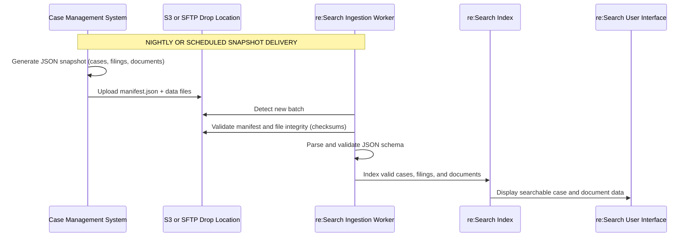

# Batch Mode Overview

**Navigation:**  
[Home](../../../README.md) › [Client Documentation](../README.md) › [Integration Modes](./README.md) › Batch Mode

Batch Mode is one of the four supported re:Search integration methods.  
It uses scheduled **JSON snapshot deliveries**—not APIs—to synchronize case, filing, party, and document metadata.

This mode is ideal for courts and CMS vendors who prefer **predictable**, **schema-driven**, and **high-volume** ingestion.

<br>

---

## 📌 At a Glance

Below is a quick summary of the Batch Mode integration pattern:

| Attribute | Description |
|----------|-------------|
| **Pattern** | Scheduled snapshot delivery |
| **Format** | JSON Lines (`.jsonl` / `.jsonl.gz`) |
| **Transport** | AWS S3 (preferred) or SFTP |
| **CMS Responsibility** | Export, package, and upload snapshot files |
| **re:Search Responsibility** | Detect, validate, and index files |
| **Primary Benefit** | Predictable, schema-based ingestion with large throughput |

<br>

---

## 🔍 How It Works

Batch Mode provides a **file-based ingestion pattern** that delivers complete or partial case datasets on a defined schedule.  
Unlike ECF mode, which relies on real-time SOAP APIs, Batch Mode is **offline**, repeatable, and optimized for large courts.

**Typical Workflow:**

1. CMS exports case, filing, party, and document metadata.  
2. CMS generates JSONL files according to schema.  
3. CMS creates a `manifest.json` describing the batch.  
4. CMS uploads all files to S3 or SFTP.  
5. re:Search detects the upload.  
6. re:Search validates, parses, and indexes the batch.

<br>

**Diagram**



---
## ⭐ Benefits

- Low barrier to implement (no SOAP/REST APIs)  
- Works with EJ, legacy, or modern CMS platforms  
- Supports nightly, hourly, or periodic ingestion  
- Scales to millions of records  
- Schema-based validation ensures data quality  
- Supports historical backfills and reprocessing  

---

## ⚠️ Limitations

- Not real-time  
- Requires full or delta export generation  
- Manifest accuracy is critical  
- JSONL must strictly follow schema formatting  
- Document binary handling may require separate delivery  

---

## 🚀 Lifecycle & Strategy

- Batch Mode is the **long-term standard** for re:Search integration  
- CIP migrations expected to complete by mid-2026  
- ECF reserved only for legacy EFM-connected vendors  
- Future enhancements include:  
  - Delta batches  
  - Streaming validators  
  - Enhanced diagnostics  

---

## 🔐 Transport & Authentication

Batch Mode **does not use APIs**.  
All ingestion occurs through **file delivery** using S3 or SFTP.

### Delivery Methods

| Method | Description | Security |
|--------|-------------|----------|
| **AWS S3 (Preferred)** | Upload snapshots to Tyler-managed buckets | IAM access keys, HTTPS, bucket isolation |
| **SFTP (Alternate)** | Upload snapshots via Tyler SFTP | SSH key auth, directory isolation |

### S3 Example Path
```text
s3://tx-research-ingest/<CMS>/<CourtCode>/<YYYY-MM-DD>/
manifest.json
cases_0001.jsonl.gz
filings_0001.jsonl.gz
documents_0001.jsonl.gz
```
### SFTP Example Path
```text
Host: sftp.tylerhost.net
Path: /research/<CMS>/<CourtCode>/<YYYY-MM-DD>/
User: <provided>
Password/Key: <provided>
```


---

## 📄 Manifest & Schema Requirements

Each batch must include a `manifest.json` file that:

- Identifies the batch (`batchId`)  
- Specifies schema version  
- Lists each file with record count and checksum  
- Defines the court scope and effective date  
- References only files present in the same directory  

### Example Manifest

```json
{
  "batchId": "ELLIS-2025-11-12-0100",
  "schemaVersion": "1.3.0",
  "generatedAt": "2025-11-12T01:05:12Z",
  "files": [
    {"type": "cases", "path": "cases_0001.jsonl.gz", "recordCount": 50000, "sha256": "…"},
    {"type": "filings", "path": "filings_0001.jsonl.gz", "recordCount": 54000, "sha256": "…"},
    {"type": "documents", "path": "documents_0001.jsonl.gz", "recordCount": 61000, "sha256": "…"}
  ],
  "scope": {
    "courtCodes": ["ELLIS-CC", "ELLIS-DC"],
    "asOfDate": "2025-11-11"
  }
}
```

## 🔗 Related Documentation

### Integration

- **Batch Mode Overview** (this page)  
- **[ECF Mode Overview →](./ecf-mode-overview.md)**  
- **[CIP Mode Overview →](./cip-mode-overview.md)**  
- **[Non-Integrated Mode Overview →](./non-integrated-mode-overview.md)**  
- **[Integration Modes Index →](./README.md)**  

### Technical

- **[NotifyCaseEvent API →](../../technical-documentation/api-reference/notifycaseevent/README.md)**  
- **[API Reference Index →](../../technical-documentation/api-reference/README.md)**  
- **[Support Playbook →](../../technical-documentation/support-playbook/README.md)**  

---

## ⬅ Back to

**[Integration Modes](./README.md)**

