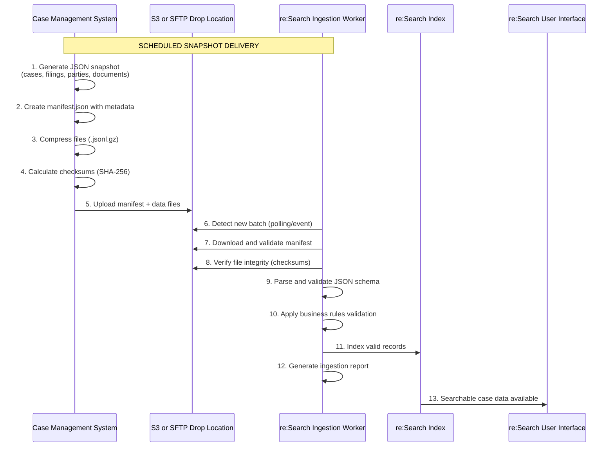

# Batch Mode Overview

**Navigation:**  
[Home](/README.md) › [Client Documentation](./client-documentation/README.md) › [Integration Modes](./client-documentation/integration-modes/README.md) › Batch Mode

---
## 📖 Quick Navigation

<table>
<tr>
<td width="50%" valign="top">

### 🚀 Getting Started
- [Overview](#overview)
- [At a Glance](#at-a-glance)
- [How It Works](#how-batch-mode-works)
- [Key Benefits](#key-benefits)

### 🔧 Implementation
- [Transport & Authentication](#transport--authentication)
- [Manifest Requirements](#manifest--schema-requirements)
- [Data File Schema](#data-file-schema)
- [Implementation Checklist](#️implementation-checklist)

</td>
<td width="50%" valign="top">

### 📊 Operations
- [Validation & Error Handling](#validation--error-handling)
- [Monitoring & Operations](#monitoring--operations)
- [Troubleshooting](#troubleshooting)

### 📚 Reference
- [Limitations & Considerations](#️limitations--considerations)
- [Strategic Roadmap](#strategic-context--roadmap)
- [Related Documentation](#related-documentation)
- [Next Steps](#️next-steps)

</td>
</tr>
</table>


## Overview

Batch Mode is a **file-based integration method** that uses scheduled JSON snapshot deliveries to synchronize case, filing, party, and document metadata with re:Search. Unlike real-time API-driven modes, Batch Mode emphasizes predictability, high-volume throughput, and schema-driven data quality.

This mode is ideal for courts and CMS vendors who need **bulk ingestion capabilities**, **historical data migration**, or prefer **offline processing** over real-time API integration.

---

## At a Glance

| Attribute | Description |
|----------|-------------|
| **Integration Pattern** | Scheduled snapshot delivery via file uploads |
| **Data Format** | JSON Lines (`.jsonl` / `.jsonl.gz`) |
| **Transport Method** | AWS S3 (preferred) or SFTP |
| **Update Frequency** | Configurable: hourly, nightly, weekly, or on-demand |
| **CMS Responsibility** | Export, package, validate, and upload snapshot files |
| **re:Search Responsibility** | Detect, validate, parse, and index uploaded files |
| **Typical Use Cases** | Historical backfills, bulk updates, non-ECF courts, high-volume ingestion |
| **Primary Advantage** | No API development required; handles millions of records efficiently |

---

## How Batch Mode Works

Batch Mode operates as a **one-way file delivery system** where your CMS generates complete or incremental snapshots of case data and uploads them to a designated storage location. re:Search automatically detects new batches, validates their contents, and indexes the data.

### Integration Flow


### Step-by-Step Process

1. **Export Generation** – Your CMS queries case data and formats it according to the Batch Mode schema
2. **File Creation** – Data is written as JSON Lines files (one JSON object per line)
3. **Manifest Creation** – A `manifest.json` file catalogs all data files with checksums
4. **Compression** – Files are optionally compressed using gzip (`.jsonl.gz`)
5. **Upload** – All files are uploaded to the designated S3 bucket or SFTP directory
6. **Detection** – re:Search monitors the location and detects the new batch
7. **Validation** – Schema validation, checksum verification, and business rule checks
8. **Indexing** – Valid records are indexed and made searchable
9. **Reporting** – Success/failure reports are generated and logged

---

## Key Benefits

### Low Technical Barrier
- **No API development required** – Avoids SOAP/REST complexity
- **Standard file formats** – Uses widely-supported JSON and compression
- **Flexible scheduling** – Run on your court's timeline

### High Performance
- **Scales to millions of records** – Handles large courts efficiently
- **Parallel processing** – Multiple files processed simultaneously
- **Optimized for bulk operations** – Better throughput than API polling

### Data Quality Assurance
- **Schema-based validation** – Ensures data consistency before indexing
- **Checksum verification** – Detects corruption during transfer
- **Rollback capability** – Failed batches don't corrupt production data

### Operational Flexibility
- **Historical backfills supported** – Load decades of legacy data
- **Reprocessing capability** – Re-run batches if needed
- **Delta or full snapshots** – Choose incremental or complete updates
- **Works with any CMS** – Compatible with EJ, Odyssey, legacy, or custom systems

---

## Limitations & Considerations

| Limitation | Impact | Mitigation |
|------------|--------|------------|
| **Not Real-Time** | Updates delayed by batch schedule (hours to days) | Use ECF Mode if real-time updates are critical |
| **Full Export Overhead** | Large courts may require significant export time | Implement delta batches to send only changes |
| **Manifest Accuracy Critical** | Incorrect manifest causes batch rejection | Validate manifest before upload; use automation |
| **Schema Strictness** | Invalid JSON causes record rejection | Pre-validate files against schema before upload |
| **Document Binary Handling** | PDFs/images require separate delivery mechanism | Use S3 multipart uploads or coordinate with BIS team |
| **Error Feedback Delay** | Validation errors discovered after upload | Monitor ingestion reports; implement pre-upload validation |

---

## Strategic Context & Roadmap

### Current State (2025)
- Batch Mode is the **recommended standard** for new re:Search integrations
- Actively replacing CIP Mode for courts migrating from Enterprise Justice
- Preferred over ECF Mode for courts without existing EFM integration

### Migration Timeline
- **CIP Mode migrations:** Expected completion by mid-2026
- **ECF Mode:** Reserved for courts with established EFM integrations
- **New implementations:** Default to Batch Mode unless real-time required

### Future Enhancements
The BIS team is developing:
- ✨ **Delta batch support** – Send only changed records
- ✨ **Streaming validators** – Pre-upload validation tools
- ✨ **Enhanced diagnostics** – Real-time ingestion monitoring dashboard
- ✨ **Incremental indexing** – Faster processing for large batches

---

## Transport & Authentication

Batch Mode uses **secure file delivery** rather than API authentication. Two transport methods are supported:

### AWS S3 (Recommended)

**Why S3?**
- Faster transfer speeds
- Built-in encryption (AES-256)
- Automatic retry and error handling
- Event-driven batch detection (instant processing)
- Integrated with AWS CloudWatch for monitoring

**Security Features:**
- IAM role-based access control
- Bucket policies restrict access to specific courts/vendors
- TLS 1.2+ encryption in transit
- Server-side encryption at rest
- S3 versioning for audit trail

**Example S3 Path Structure:**
```text
s3://tx-research-ingest-prod/<CMSVendor>/<CourtCode>/<YYYY-MM-DD>/
  ├── manifest.json
  ├── cases_0001.jsonl.gz
  ├── cases_0002.jsonl.gz
  ├── filings_0001.jsonl.gz
  ├── parties_0001.jsonl.gz
  └── documents_0001.jsonl.gz
```

**Upload Methods:**
- AWS CLI: `aws s3 cp batch/ s3://bucket/path/ --recursive`
- SDK: boto3 (Python), AWS SDK (Java, .NET, Node.js)
- S3 Browser tools (Cyberduck, CloudBerry, etc.)

---

### SFTP (Alternative)

**When to Use SFTP:**
- Your CMS cannot integrate with AWS S3
- Corporate policy restricts cloud storage
- Existing SFTP automation already in place

**Security Features:**
- SSH key-based authentication (password auth disabled)
- Chroot jail isolation per court
- TLS encryption for all transfers
- Connection logging and audit trails

**Example SFTP Configuration:**
```text
Host: sftp.tylerhost.net
Port: 22
Path: /research-ingest/<CMSVendor>/<CourtCode>/<YYYY-MM-DD>/
Authentication: SSH key (provided by BIS team)
```

**Upload Example:**
```bash
sftp -i ~/.ssh/research_key user@sftp.tylerhost.net
cd /research-ingest/MyVendor/ELLIS-CC/2025-11-12/
put manifest.json
put cases_*.jsonl.gz
put filings_*.jsonl.gz
bye
```

---

### Credential Management

**S3 Credentials:**
- Provided by BIS team during onboarding
- IAM access key + secret key
- Rotate every 90 days (automated reminder)
- Scoped to specific buckets only

**SFTP Credentials:**
- SSH private key provided via secure channel
- Public key fingerprint verification required
- Key rotation every 180 days

---

## Manifest & Schema Requirements

Every batch **must include a manifest.json file** that describes the batch contents. This file enables re:Search to validate file integrity before processing.

### Manifest Structure
```json
{
  "batchId": "ELLIS-2025-11-12-0100",
  "schemaVersion": "1.3.0",
  "generatedAt": "2025-11-12T01:05:12Z",
  "courtSystem": "ELLIS-COUNTY",
  "batchType": "FULL",
  "files": [
    {
      "type": "cases",
      "path": "cases_0001.jsonl.gz",
      "recordCount": 50000,
      "sha256": "a3d8f9e7c2b1a5d4e8f9c7b6a5d4e8f9c7b6a5d4e8f9c7b6a5d4e8f9c7b6a5d4",
      "sizeBytes": 15728640
    },
    {
      "type": "filings",
      "path": "filings_0001.jsonl.gz",
      "recordCount": 54000,
      "sha256": "b4e9f0a8d3c2b6e5f9a8d7c6b5e4f9a8d7c6b5e4f9a8d7c6b5e4f9a8d7c6b5e4",
      "sizeBytes": 18874368
    },
    {
      "type": "documents",
      "path": "documents_0001.jsonl.gz",
      "recordCount": 61000,
      "sha256": "c5f0a1b9e4d3c7f6a9b8e7d6c5f4a9b8e7d6c5f4a9b8e7d6c5f4a9b8e7d6c5f4",
      "sizeBytes": 12582912
    }
  ],
  "scope": {
    "courtCodes": ["ELLIS-CC", "ELLIS-DC", "ELLIS-JP1"],
    "asOfDate": "2025-11-11",
    "includesHistorical": false
  },
  "contact": {
    "vendor": "Acme CMS Inc.",
    "email": "support@acmecms.com"
  }
}
```

### Required Manifest Fields

| Field | Type | Required | Description |
|-------|------|----------|-------------|
| `batchId` | string | ✅ | Unique identifier (format: `<COURT>-<DATE>-<SEQ>`) |
| `schemaVersion` | string | ✅ | Must match current schema version (currently `1.3.0`) |
| `generatedAt` | ISO 8601 | ✅ | Timestamp when batch was created |
| `files` | array | ✅ | List of all data files with metadata |
| `files[].type` | enum | ✅ | One of: `cases`, `filings`, `parties`, `documents` |
| `files[].path` | string | ✅ | Relative filename (must exist in same directory) |
| `files[].recordCount` | integer | ✅ | Number of JSON objects in file |
| `files[].sha256` | string | ✅ | SHA-256 checksum of file contents |
| `scope.courtCodes` | array | ✅ | Court identifiers covered by this batch |
| `scope.asOfDate` | date | ✅ | Effective date of data snapshot |

### Optional Manifest Fields

| Field | Type | Description |
|-------|------|-------------|
| `batchType` | enum | `FULL` (complete snapshot) or `DELTA` (changes only) |
| `scope.includesHistorical` | boolean | `true` if batch contains backfilled historical data |
| `contact.vendor` | string | CMS vendor name for support purposes |
| `contact.email` | string | Support contact for batch issues |

---

## Data File Schema

Each data file must be in **JSON Lines format** (one JSON object per line, no commas between objects).

### Cases File Example (`cases_0001.jsonl`)
```jsonl
{"caseId":"2024-CV-00123","courtCode":"ELLIS-CC","caseNumber":"CV-2024-00123","caseTitle":"Smith v. Jones","filingDate":"2024-03-15","caseType":"Civil","caseStatus":"Active","security":{"level":"PUBLIC"}}
{"caseId":"2024-CR-00456","courtCode":"ELLIS-DC","caseNumber":"CR-2024-00456","caseTitle":"State v. Johnson","filingDate":"2024-03-16","caseType":"Criminal","caseStatus":"Pending","security":{"level":"PUBLIC"}}
```

### Required Case Fields

- `caseId` – Unique case identifier in CMS
- `courtCode` – Court jurisdiction code
- `caseNumber` – Docket number
- `caseTitle` – Case caption
- `filingDate` – Date case was filed
- `caseType` – Case type (Civil, Criminal, Family, etc.)
- `caseStatus` – Current case status
- `security.level` – One of: `PUBLIC`, `CONFIDENTIAL`, `SEALED`

**Full schema documentation:** [Contact BIS team for schema specifications]

---

## Validation & Error Handling

### Validation Stages

1. **Manifest Validation**
   - Schema version compatibility check
   - Required fields presence
   - File reference integrity (all listed files exist)

2. **File Integrity Validation**
   - SHA-256 checksum verification
   - File size validation
   - Compression format check

3. **Schema Validation**
   - JSON syntax parsing
   - Required field validation
   - Data type verification
   - Enum value validation

4. **Business Rule Validation**
   - Court code authorization
   - Date range reasonableness
   - Cross-reference integrity (e.g., filings reference valid cases)

### Error Reporting

Failed batches generate detailed error reports uploaded to:
```
s3://<bucket>/<path>/_reports/batch-<batchId>-errors.json
```

Example error report:
```json
{
  "batchId": "ELLIS-2025-11-12-0100",
  "status": "FAILED",
  "errors": [
    {
      "file": "cases_0001.jsonl.gz",
      "line": 1523,
      "error": "Missing required field: caseNumber",
      "record": {"caseId": "2024-CV-01523", ...}
    },
    {
      "file": "filings_0001.jsonl.gz",
      "line": 892,
      "error": "Invalid caseId reference: case 2024-CV-99999 not found in cases file"
    }
  ],
  "summary": {
    "totalRecords": 165000,
    "validRecords": 164998,
    "errorRecords": 2
  }
}
```

---

## Implementation Checklist

### For CMS Vendors

- [ ] **Obtain credentials** from BIS team (S3 IAM keys or SFTP SSH keys)
- [ ] **Review schema documentation** (request from BIS team)
- [ ] **Develop export logic** to query case data from CMS
- [ ] **Implement JSON Lines writer** with schema compliance
- [ ] **Build manifest generator** with SHA-256 checksum calculation
- [ ] **Test file compression** (gzip recommended)
- [ ] **Implement upload automation** (AWS CLI, SDK, or SFTP)
- [ ] **Create monitoring** for export success/failure
- [ ] **Set up scheduling** (cron, task scheduler, etc.)
- [ ] **Document runbook** for operations team

### For Courts

- [ ] **Coordinate with CMS vendor** on batch schedule
- [ ] **Provide court codes** and jurisdiction mapping
- [ ] **Review data scope** (which case types, date ranges)
- [ ] **Plan historical backfill** if needed
- [ ] **Establish change window** for initial load
- [ ] **Designate technical contact** for troubleshooting
- [ ] **Schedule testing period** with BIS team

---

## Monitoring & Operations

### Success Metrics

- **Batch completion rate**: Target 99%+
- **Record validation rate**: Target 99.9%+
- **Processing latency**: < 2 hours for typical batch
- **Error resolution time**: < 24 hours

### Operational Dashboard (coming soon)

The BIS team is developing a self-service dashboard showing:
- Recent batch history
- Success/failure status
- Record counts and processing times
- Error summaries with drill-down

**Current monitoring:** Email notifications sent to vendor contact on batch completion

---

## Troubleshooting

### Common Issues

| Problem | Cause | Solution |
|---------|-------|----------|
| Batch not detected | Incorrect file path | Verify upload location matches agreed path structure |
| Checksum mismatch | File corruption during transfer | Re-upload affected file |
| Schema validation errors | Invalid JSON or missing fields | Run pre-upload validator (request from BIS) |
| Permission denied (S3) | IAM credentials expired or incorrect | Verify access key; request rotation if needed |
| Connection refused (SFTP) | IP not whitelisted | Provide source IP to BIS team |
| Duplicate batchId | Re-running same batch | Use new batchId for each attempt |

### Getting Help

**For batch processing issues:**
- Check error report in `_reports/` directory
- Contact your Technical Project Manager
- Include batchId and error report in support request

**For credential issues:**
- Email BIS team: [BIS Team](mailto:EFMInfo@tylertech.com)
- Request credential rotation or permission adjustment

---

## Related Documentation

### Integration Modes
- **[Integration Modes Overview →](./client-documentation/integration-modes/README.md)** – Compare all integration methods
- **[ECF Mode Overview →](./client-documentation/integration-modes/ecf-mode-overview.md)** – Real-time API-driven integration
- **[CIP Mode Overview →](./client-documentation/integration-modes/cip-mode-overview.md)** – REST-based EJ publishing
- **[Non-Integrated Mode Overview →](./client-documentation/integration-modes/non-integrated-mode-overview.md)** – Manual publishing

### Technical Resources
- **[API Reference →](./technical-documentation/api-reference/README.md)** – For ECF/CIP mode details
- **[Support Playbook →](./technical-documentation/support-playbook/README.md)** – Troubleshooting guides
- **[Client Onboarding →](./client-documentation/integration-modes/onboarding/README.md)** – Implementation process

### Onboarding
- **[Environment Access →](./client-documentation/integration-modes/onboarding/02-environment-access.md)** – Getting credentials
- **[Technical Onboarding →](./client-documentation/integration-modes/onboarding/05-technical-onboarding.md)** – Implementation guidance
- **[Testing & Certification →](./client-documentation/integration-modes/onboarding/06-testing-and-certification.md)** – Validation requirements

---

## Next Steps

**Ready to implement Batch Mode?**

1. **Contact your TPM** to schedule a kickoff meeting
2. **Request schema documentation** and sample files from BIS team
3. **Review the [Client Onboarding Guide](./client-documentation/integration-modes/onboarding/README.md)** for implementation timeline
4. **Obtain credentials** for your test environment
5. **Begin development** using test data

**Have questions?** Reach out to the BIS team at [BIS Team](mailto:EFMInfo@tylertech.com)

---

[← Back to Integration Modes](./client-documentation/integration-modes/README.md) | [Client Onboarding Guide →](./client-documentation/integration-modes/onboarding/README.md)