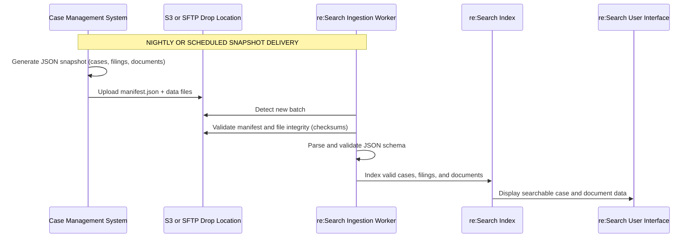

# Batch Mode Overview

Batch Mode is the **standard integration model** for all new re:Search implementations.  

It uses scheduled JSONL snapshot deliveries instead of APIs, offering predictable, scalable, and schema-driven ingestion.

---

## At a Glance

| Attribute | Description |
|----------|-------------|
| **Pattern** | Scheduled snapshot delivery |
| **Format** | JSON Lines (`.jsonl` / `.jsonl.gz`) |
| **Transport** | AWS S3 (preferred) or SFTP |
| **CMS Role** | Export, package, and upload data |
| **re:Search Role** | Retrieve, validate, and index |
| **Primary Benefit** | Predictable, schema-based ingestion |

---

## How It Works

The **Batch Integration Mode** provides a scheduled, file-based method for CMS vendors to supply complete case data snapshots to **re:Search**.  
Unlike ECF integrations that depend on real-time API traffic, Batch mode delivers **periodic, authoritative exports** of case information via secure file transfer (typically nightly).

This mode is ideal for CMS vendors who do not have an existing ECF pipeline or whose courts prefer periodic data refreshes instead of continuous synchronization.

1. CMS exports case/filing/party/document metadata.  
2. CMS generates one or more JSONL data files.  
3. CMS generates a `manifest.json` describing file contents.  
4. CMS uploads all files to S3 or SFTP.  
5. re:Search detects the batch and begins ingestion.  
6. Data is validated, indexed, and surfaced in the UI.

**Diagram**  

---
## Benefits

- Simple setup, minimal firewall requirements  
- Works for both EJ and third-party CMS vendors  
- Supports nightly, hourly, or periodic ingestion  
- Highly scalable for statewide deployments  
- Schema-driven validation increases data quality  
- Reprocessing and historical corrections supported 

---

## Limitations

- Not real-time  
- Requires full export per run unless using deltas  
- Large courts require efficient JSONL generation  
- Manifest accuracy is critical for successful ingestion  
---

## Lifecycle & Strategy

- Batch Mode is the **long-term standard** for all integrations  
- CIP migrations target completion by **mid-2026**  
- ECF supported only for legacy vendors  
- Future enhancements include:  
  - Stream-validated uploads  
  - Incremental delta batches  
  - Enhanced ingestion diagnostics  
---

## Transport & Authentication

### No REST/SOAP API's

Batch Mode **never** uses HTTP API calls.

Instead, the CMS drops files using one of the following:

| Method | Description | Security |
|---|---|---|
| **AWS S3 (Preferred)** | Direct upload to Tyler S3 bucket | Access key encryption, HTTPS, IAM isolation |
| **SFTP (Alternate)** | File transfer to Tyler SFTP endpoint | SSH key authentication, folder isolation |

---

### S3 Example

A typical S3 path structure:

```text
s3://tx-research-ingest/<CMS>/<CourtCode>/<YYYY-MM-DD>/
  manifest.json
  cases_0001.jsonl.gz
  filings_0001.jsonl.gz
  documents_0001.jsonl.gz
```
---

### SFTP Example

A typical S3 path structure:

```text
Host: sftp.tylerhost.net
Path: /research/<CMS>/<CourtCode>/<YYYY-MM-DD>/
User: <provided>
Password/Key: <provided>
```
---

## Manifest and Schema

Each batch must include a manifest.json file that:
- Identifies the batch (batchId)
- Specifies the schema version
- Lists each data file with type, path, record count, and checksum
- Defines the scope (courts and effective date)
All referenced files must exist in the same folder as the manifest.

Each batch run must include a `manifest.json` file that describes the snapshot contents and verifies data integrity. All referenced files must exist in the same folder.

**Example Manifest**
```json
{
  "batchId": "ELLIS-2025-11-12-0100",
  "schemaVersion": "1.3.0",
  "generatedAt": "2025-11-12T01:05:12Z",
  "files": [
    {"type": "cases", "path": "cases_0001.jsonl.gz", "recordCount": 50000, "sha256": "…"},
    {"type": "filings", "path": "filings_0001.jsonl.gz", "recordCount": 54000, "sha256": "…"},
    {"type": "documents", "path": "documents_0001.jsonl.gz", "recordCount": 61000, "sha256": "…"}
  ],
  "scope": {
    "courtCodes": ["ELLIS-CC", "ELLIS-DC"],
    "asOfDate": "2025-11-11"
  }
}
```
---

## Related Documentation

- [Batch Mode Overview](./batch-mode-overview.md)
- [NotifyCaseEvent API Reference](../../technical-documentation/api-reference/notifycaseevent/README.md)
- [Integration Modes Overview](./README.md)

**Back to:** [Integration Modes](./README.md)
