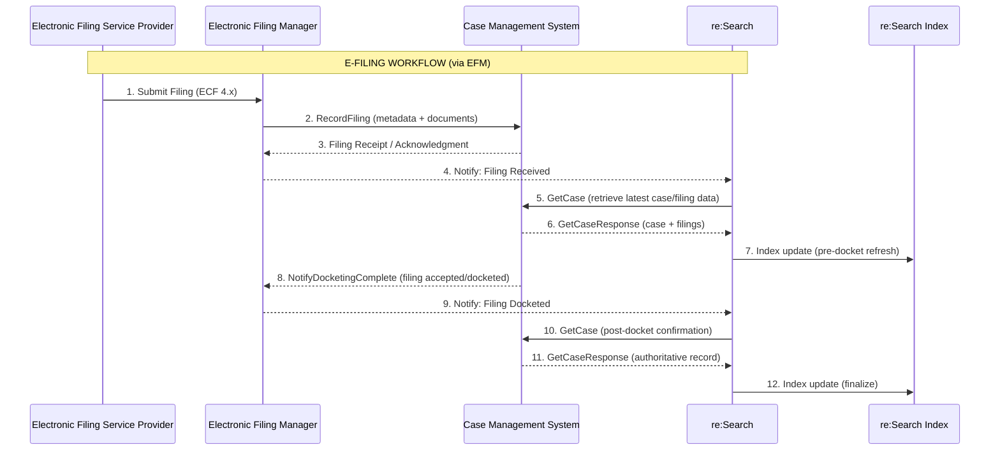
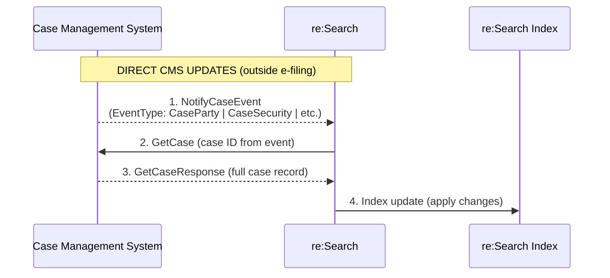

# ECF Mode Overview

**Navigation:**  
[Home](/README.md) › [Client Documentation](./client-documentation/README.md) › [Integration Modes](./client-documentation/integration-modes/README.md) › ECF Mode

---

## 📖 Quick Navigation

<table>
<tr>
<td width="50%" valign="top">

### 🚀 Getting Started
- [Overview](#overview)
- [Summary](#summary)
- [When to Use ECF Mode](#when-to-use-ecf-mode)
- [Limitations](#️limitations)

### 🔄 How It Works
- [How ECF Mode Works](#how-ecf-mode-works)
- [Filing Workflow (via EFM)](#filing-workflow-via-efm)
- [CMS → re:Search Updates](#cms--research-outside-e-filing)

</td>
<td width="50%" valign="top">

### 📡 Technical Reference
- [APIs Used in ECF Mode](#apis-used-in-ecf-mode)
- [Filing Workflow APIs](#filing-workflow-efm--cms)
- [Case Synchronization APIs](#case-synchronization-cms--research)
- [Document Retrieval](#document-retrieval-optional)

### 📚 Resources
- [Related Documentation](#related-documentation)

</td>
</tr>
</table>

---

## Overview

ECF Mode is an **event-driven** integration method used primarily by legacy CMS vendors who already support the statewide **EFM (Electronic Filing Manager)**. It relies on **real-time SOAP/XML messaging**, coordinated between:

- **CMS** – Publishes case updates and responds to GetCase  
- **EFM** – Routes e-filing submissions (RecordFiling / NotifyDocketingComplete)  
- **re:Search** – Receives events and synchronizes with CMS using GetCase  

This creates a continuous synchronization model for courts participating in e-filing.

---

## Summary

| Attribute | Description |
|-----------|-------------|
| **Primary Use** | Legacy real-time ECF integrations |
| **Pattern** | Event-driven (NotifyCaseEvent + docketing updates) |
| **Transport** | SOAP 1.2 over HTTPS |
| **Dependencies** | EFM, CMS, mTLS, ECF 4.x schema compliance |
| **Real-Time** | Yes |
| **Complexity** | High |

---

## When to Use ECF Mode

ECF Mode is appropriate when:

| Scenario | Use ECF Mode When… |
|----------|---------------------|
| **Existing ECF Infrastructure** | CMS already supports ECF 4.x and connects to the EFM |
| **Real-Time Requirements** | Court requires immediate synchronization of filings and case updates |
| **Legacy Integrations** | Court is already wired into EFM and cannot move to Batch yet |

**Not sure if ECF Mode is right for you?**  
→ Review the [Integration Modes Overview](./client-documentation/integration-modes/README.md) or use our [Mode Selection Decision Tree](./client-documentation/integration-modes/selection-decision-tree.md)

---

## Limitations

| Limitation | Impact |
|------------|--------|
| **SOAP/XML Complexity** | Requires ECF 4.x schemas, strict WSDL conformance, and SOAP expertise |
| **High Implementation Effort** | More complex than Batch Mode; longer development timeline |
| **Legacy-Only Status** | Reserved for courts already integrated with EFM; new implementations should use Batch Mode |
| **EventType Accuracy Critical** | Incorrect EventTypes cause indexing errors and sync issues |
| **mTLS Certificate Management** | Requires certificate rotation, monitoring, and secure storage |

**Alternative:** If your court doesn't have existing EFM integration, consider [Batch Mode](./client-documentation/integration-modes/batch-mode-overview.md) for simpler implementation.

---

## How ECF Mode Works 

ECF Mode operates through two primary workflows:

1. **Filing Workflow (via EFM)** – E-filed documents flow through the EFM to the CMS, then sync to re:Search
2. **Direct CMS Updates** – Non-filing events (party changes, dispositions, etc.) are published directly from CMS to re:Search

### Filing Workflow (via EFM)

When an attorney files a document through an EFSP (Electronic Filing Service Provider), the following sequence occurs:

**Step-by-Step Process:**

1. **EFSP submits a filing** to the EFM with case metadata and documents
2. **EFM validates** the filing and routes it to the appropriate CMS via `RecordFiling`
3. **CMS processes the filing** and returns a receipt/acknowledgment to the EFM
4. **re:Search is notified** of the filing receipt and performs a pre-docket refresh via `GetCase`
5. **CMS dockets the filing** and sends `NotifyDocketingComplete` back to the EFM
6. **EFM notifies re:Search** of the completed docketing
7. **re:Search retrieves the final case state** via `GetCase` and updates the index

**Workflow Diagram:**


**Why Two GetCase Calls?**
- **First GetCase** (after filing receipt) – Ensures re:Search has preliminary filing data
- **Second GetCase** (after docketing) – Retrieves the authoritative, docketed record with final metadata

---

### CMS → re:Search (Outside e-Filing) 🔄

For updates occurring **outside** the filing workflow (such as case parties, security changes, dispositions, or reassignments), the CMS uses **NotifyCaseEvent** to trigger synchronization:

**Step-by-Step Process:**

1. **CMS detects a case change** (party added, case sealed, disposition entered, etc.)
2. **CMS sends NotifyCaseEvent** to re:Search with the appropriate `EventType`
3. **re:Search receives the event** and initiates a `GetCase` call
4. **CMS responds with GetCaseResponse** containing the complete, current case data
5. **re:Search indexes the updated case** and makes it searchable

**Workflow Diagram:**


**Supported EventTypes:**
- `CaseFiling` – New filing added outside EFM workflow
- `CaseParty` – Party or attorney changes
- `CaseSecurity` – Security level changes (sealed/unsealed)
- `CaseReassigned` – Judge or division reassignment
- `CaseDisposition` – Case outcome/disposition entered
- `CaseInitiated` – New case created in CMS
- `CaseExpunged` – Case expungement
- `DocumentFiling` – Document metadata changes
- `DocumentSecurity` – Document-level security changes

**Full EventType documentation:** [NotifyCaseEvent API Reference](./technical-documentation/api-reference/notifycaseevent/README.md)

---

## APIs Used in ECF Mode 📡

These are the **required APIs** for an ECF Mode integration. Grouped by workflow for clarity.

> **Note:** EFM documentation must also be consulted for this integration mode and is available in a separate folder.

---

###  Filing Workflow (EFM ↔ CMS) 📨

| API | Direction | Purpose | Documentation |
|-----|-----------|---------|---------------|
| **RecordFiling** | EFM → CMS | Delivers filing packages with metadata and documents | [RecordFiling →](./technical-documentation/api-reference/recordfiling/README.md) |
| **NotifyDocketingComplete** | CMS → EFM | Confirms filing has been docketed and accepted | [NotifyDocketingComplete →](./technical-documentation/api-reference/notifydocketingcomplete/README.md) |

---

###  Case Synchronization (CMS → re:Search)

| API | Direction | Purpose | Documentation |
|-----|-----------|---------|---------------|
| **NotifyCaseEvent** | CMS → re:Search | Indicates which case fields changed (triggers sync) | [NotifyCaseEvent →](../technical-documentation/api-reference/notifycaseevent/README.md) |
| **GetCase** | re:Search → CMS | Retrieves the authoritative case record with all current data | [GetCase →](./technical-documentation/api-reference/getcase/README.md) |

---

###  Document Retrieval (Optional)

| API | Direction | Purpose | Documentation |
|-----|-----------|---------|---------------|
| **GetDocument** | re:Search → CMS | Retrieves document binaries (PDFs, images) on-demand | [GetDocument →](./technical-documentation/api-reference/getdocument/README.md) |

**Note:** GetDocument is optional. Many courts prefer to host documents separately and provide URLs in GetCase responses.

---

##  Security & Authentication

### mTLS (Mutual TLS)

ECF Mode requires **mutual TLS authentication** for all SOAP communications:

- **Client certificates** issued by Tyler Technologies or approved CA
- **Certificate rotation** required every 12-18 months
- **Certificate pinning** recommended for production environments
- **Secure storage** of private keys (HSM or encrypted key stores)

### Endpoint Configuration

**Test Environment:**
```
https://test-ecf.tylerhost.net/ECFWebService
```

**Production Environment:**
```
https://ecf.tylerhost.net/ECFWebService
```

**Certificate requests:** Contact your Technical Project Manager during onboarding

---

##  Implementation Requirements

### For CMS Vendors

**Required Capabilities:**
- [ ] SOAP 1.2 client implementation
- [ ] ECF 4.x schema compliance (WSDL validation)
- [ ] mTLS certificate management
- [ ] NotifyCaseEvent publishing logic
- [ ] GetCase response generation
- [ ] RecordFiling handling (if supporting e-filing)
- [ ] NotifyDocketingComplete publishing
- [ ] Error handling and retry logic
- [ ] Audit logging for all API calls

**Development Timeline:**
- Initial implementation: 8-12 weeks
- Testing and certification: 4-6 weeks
- Production deployment: 2 weeks

### For Courts

**Prerequisites:**
- Active EFM integration (for filing workflows)
- CMS vendor supporting ECF Mode
- Network connectivity to Tyler ECF endpoints
- Firewall rules allowing HTTPS outbound to Tyler hosts

---

##  Monitoring & Troubleshooting

### Key Metrics

- **Event delivery rate:** Target 99.9%+
- **GetCase response time:** < 2 seconds
- **Event-to-index latency:** < 30 seconds
- **Failed event rate:** < 0.1%

### Common Issues

| Problem | Cause | Solution |
|---------|-------|----------|
| Events not reaching re:Search | Network/firewall blocking | Verify outbound HTTPS access to Tyler endpoints |
| GetCase timeout | CMS query performance | Optimize CMS database queries; add indexes |
| Certificate errors | Expired or invalid mTLS cert | Renew certificate; verify installation |
| Incorrect EventType | Business logic error | Review [EventType Logic Guide](./technical-documentation/support-playbook/eventtype-logic.md) |
| Missing case data in GetCase | Incomplete response mapping | Validate against ECF 4.x schema requirements |

**For detailed troubleshooting:** See [Support Playbook](./technical-documentation/support-playbook/README.md)

---

##  Migration Path

### Moving from ECF to Batch Mode

If your court is currently using ECF Mode but wants to simplify operations:

**Benefits of migrating to Batch Mode:**
- ✅ Eliminates SOAP/XML complexity
- ✅ Reduces operational overhead
- ✅ Simplifies certificate management
- ✅ More predictable processing schedules

**Migration process:**
1. Coordinate with BIS team to schedule migration
2. Implement Batch Mode export logic
3. Run parallel operations (ECF + Batch) during transition
4. Validate data consistency between modes
5. Cutover to Batch Mode only
6. Decommission ECF endpoints

**Timeline:** Typically 6-8 weeks with BIS support

**Contact your TPM** to discuss migration options

---

##  Related Documentation

### Integration Modes
- **[Integration Modes Overview →](./client-documentation/integration-modes/README.md)** – Compare all integration methods
- **[Batch Mode Overview →](./client-documentation/integration-modes/batch-mode-overview.md)** – Simpler file-based integration
- **[CIP Mode Overview →](./client-documentation/integration-modes/cip-mode-overview.md)** – REST-based EJ publishing
- **[Non-Integrated Mode Overview →](./client-documentation/integration-modes/non-integrated-mode-overview.md)** – Manual publishing

### API Documentation
- **[NotifyCaseEvent →](./technical-documentation/api-reference/notifycaseevent/README.md)** – Event publishing specification
- **[GetCase →](./technical-documentation/api-reference/getcase/README.md)** – Case retrieval specification
- **[RecordFiling →](./technical-documentation/api-reference/recordfiling/README.md)** – Filing delivery specification
- **[NotifyDocketingComplete →](./technical-documentation/api-reference/notifydocketingcomplete/README.md)** – Docketing confirmation
- **[API Reference Index →](./technical-documentation/api-reference/README.md)** – Complete API catalog

### Support Resources
- **[Support Playbook →](./technical-documentation/support-playbook/README.md)** – Troubleshooting guides
- **[EventType Logic →](./technical-documentation/support-playbook/eventtype-logic.md)** – EventType selection guide
- **[Security Logic →](./technical-documentation/support-playbook/security_logic.md)** – Sealed case handling

### Onboarding
- **[Client Onboarding →](./client-documentation/onboarding/README.md)** – Implementation process
- **[Technical Onboarding →](./client-documentation/onboarding/05-technical-onboarding.md)** – Development guidance
- **[Testing & Certification →](./client-documentation/onboarding/06-testing-and-certification.md)** – Validation requirements

---

##  Next Steps

**Ready to implement ECF Mode?**

1. **Verify EFM integration** – Confirm your CMS is already integrated with the statewide EFM
2. **Contact your TPM** – Schedule a technical kickoff meeting
3. **Request certificates** – Obtain mTLS certificates for test environment
4. **Review API documentation** – Study [NotifyCaseEvent](./technical-documentation/api-reference/notifycaseevent/README.md) and [GetCase](./technical-documentation/api-reference/getcase/README.md) specifications
5. **Begin development** – Implement SOAP client and event publishing logic
6. **Schedule testing** – Work with BIS team to validate integration

**Have questions?** Reach out to the BIS team at [BIS Team](mailto:EFMInfo@tylertech.com)

---

[← Back to Integration Modes](./README.md) | [Batch Mode Overview →](./client-documentation/batch-mode-overview.md)