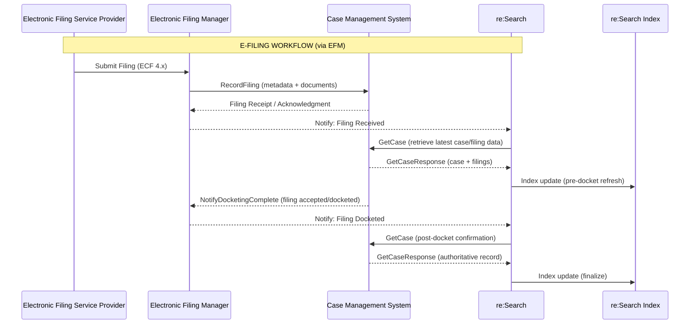
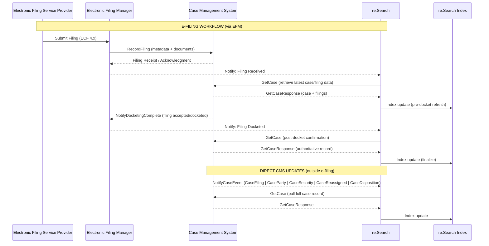

# ECF Mode Overview

**Navigation:**  
[Home](../../../README.md) › [Client Documentation](../README.md) › [Integration Modes](./README.md) › ECF Mode

ECF Mode is an **event-driven** integration method used primarily by legacy CMS vendors who already support the statewide **EFM (Electronic Filing Manager)**.  
It relies on **real-time SOAP/XML messaging**, coordinated between:

- **CMS** – Publishes case updates and responds to GetCase  
- **EFM** – Routes e-filing submissions (RecordFiling / NotifyDocketingComplete)  
- **re:Search** – Receives events and synchronizes with CMS using GetCase  

This creates a continuous synchronization model for courts participating in e-filing.

---

## 📌 Summary

| Attribute | Description |
|-----------|-------------|
| **Primary Use** | Legacy real-time ECF integrations |
| **Pattern** | Event-driven (NotifyCaseEvent + docketing updates) |
| **Transport** | SOAP 1.2 over HTTPS |
| **Dependencies** | EFM, CMS, mTLS, ECF 4.x schema compliance |
| **Real-Time** | Yes |
| **Complexity** | High |

---

## 🧭 When to Use ECF Mode

ECF Mode is appropriate when:

| Scenario | Use ECF Mode When… |
|----------|---------------------|
| **Existing ECF Infrastructure** | CMS already supports ECF 4.x and connects to the EFM |
| **Real-Time Requirements** | Court requires immediate synchronization of filings and case updates |
| **Legacy Integrations** | Court is already wired into EFM and cannot move to Batch yet |

---

## ⚠️ Limitations

- Requires **SOAP/XML**, ECF 4.x schemas, and strict WSDL conformance  
- Higher complexity than Batch Mode  
- Only used for **legacy** and **EFM-connected** vendors  
- EventType accuracy is critical for correct re:Search behavior  
---

## 🔍 How ECF Mode Works

### Filing Workflow (via EFM)

1. **EFSP submits a filing** to the EFM  
2. **EFM routes the filing** to the CMS through a `RecordFiling` call  
3. **CMS processes and dockets** the filing  
4. **CMS sends NotifyDocketingComplete** back to the EFM  
5. **EFM notifies re:Search**, which triggers:  
   - re:Search → CMS **GetCase**  
   - re:Search indexes updated case data  

**Diagram**  

---

## 🔄 CMS → re:Search (Outside e-Filing)

For updates occurring **outside** the filing workflow:

1. CMS sends **NotifyCaseEvent** with the appropriate `EventType`  
2. re:Search retrieves the full case using **GetCase**  
3. Case data is indexed and becomes searchable  

**Diagram Placeholder:**  

---
# 📡 APIs Used in ECF Mode

These are the **required APIs** for an ECF Mode integration.  
Grouped by workflow for clarity.

Please be advised that EFM documentation must also be consulted for this integration mode, and is available in a separate folder.
---

### 📨 Filing Workflow (EFM ↔ CMS)

| API | Purpose | Link |
|------|---------|------|
| **RecordFiling** | EFM → CMS delivery of filing packages | [RecordFiling →](../../technical-documentation/api-reference/recordfiling/README.md) |
| **NotifyDocketingComplete** | CMS → EFM confirmation of docketing | [NotifyDocketingComplete →](../../technical-documentation/api-reference/notifydocketingcomplete/README.md) |

---

### 🔄 Case Synchronization (CMS → re:Search)

| API | Purpose | Link |
|------|---------|------|
| **NotifyCaseEvent** | CMS indicates which case fields changed | [NotifyCaseEvent →](../../technical-documentation/api-reference/notifycaseevent/README.md) |
| **GetCase** | re:Search retrieves the authoritative case record | [GetCase →](../../technical-documentation/api-reference/getcase/README.md) |

---

### 📄 Document Retrieval (Optional)

| API | Purpose | Link |
|------|---------|------|
| **GetDocument** | Retrieve document binaries | [GetDocument →](../../technical-documentation/api-reference/getdocument/README.md) |

---

# 🔗 Related Documentation

### Integration

- **[Integration Modes Overview →](./README.md)**  
- **[Batch Mode Overview →](./batch-mode-overview.md)**  
- **[CIP Mode Overview →](./cip-mode-overview.md)**  
- **[Non-Integrated Mode Overview →](./non-integrated-mode-overview.md)**   

### Technical

- **[API Reference Index →](../../technical-documentation/api-reference/README.md)**  
- **[Support Playbook →](../../technical-documentation/support-playbook/README.md)**  

---

# ⬅ Back to

**[Integration Modes](./README.md)**