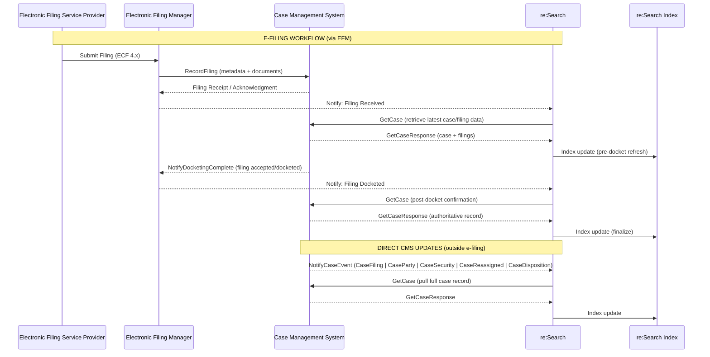

# ECF Mode Overview

ECF Mode is an event-driven integration that relies on a **three-way coordination** between systems:

- **CMS** – Publishes case-related changes and initiates event messages  
- **EFM** – Processes and routes e-filing submissions  
- **re:Search** – Consumes events and retrieves authoritative data for indexing and display  

This structure allows for continuous synchronization of case data across all systems participating in the e-filing lifecycle.

---

## Key Concepts

- The **EFM** acts as the central message broker for filings and case events.  
- Vendors send standardized ECF 4.x messages to update filings, case parties, security, and dockets.  
- re:Search retrieves the authoritative case record directly from the CMS using **GetCase**.  
- All communication uses **SOAP/XML over HTTPS** with **mutual TLS (mTLS)**.

---
## When to Use ECF Mode

ECF Mode is appropriate when:

- The CMS already supports ECF 4.x  
- The state uses an EFM and requires event-driven messaging  
- Real-time posting is required  
---

## Limitations

- Requires mTLS, SOAP/XML, and ECF 4.x validation  
- Higher complexity than Batch Mode  
- Not used for new implementations (legacy only)  
- EventType must match the type of update (important for re:Search processing)  
---

## How ECF Mode Works

### 1. Filing Submitted
The EFSP submits a filing package to the EFM using standard ECF XML.

### 2. Filing Routed to CMS  
EFM forwards the filing to the CMS through a `RecordFiling` request.

### 3. CMS Accepts & Dockets  
CMS processes the filing and responds with `NotifyDocketingComplete`.

### 4. CMS Sends Case Updates  
For all non-filing updates (parties, security, dispositions, etc.), CMS sends `NotifyCaseEvent` directly to re:Search.

### 5. re:Search Retrieves the Case  
After any event (filing or non-filing), re:Search performs a `GetCase` call to obtain the full, authoritative case snapshot.

### 6. re:Search Indexes the Case  
The case is indexed and becomes searchable within the platform.

**Diagram placeholder**  
(Add a GitHub Mermaid diagram here if desired.)

---

### Outside of e-Filing (Direct CMS Updates)

For case activity that occurs **outside the e-filing workflow**—such as case party updates, new documents, or security changes—the CMS communicates directly with re:Search.

1. **NotifyCaseEvent Sent**  
   The **CMS** sends a `NotifyCaseEvent` message directly to **re:Search**, indicating a change has occurred.  
   Each message includes an `EventType` (e.g., `CaseFiling`, `CaseParty`, `CaseSecurity`) that tells re:Search what type of update to process.

2. **re:Search Retrieves Updated Case Data**  
   Upon receiving the event, **re:Search** sends a `GetCase` request to the **CMS** to pull the full case record and any associated updates.

3. **Case Indexed in re:Search**  
   The retrieved case data is indexed, ensuring re:Search reflects the latest details, including updated parties, filings, or document security settings.

---
## Data Flow Diagram

---

## Related Documentation

- [Integration Modes Overview](./README.md)  
- [Batch Mode Overview](./batch-mode-overview.md)  
- [CIP Mode Overview](./cip-mode-overview.md)  
- [Non-Integrated Mode Overview](./non-integrated-mode-overview.md)  
- [Integration Mode Selection Decision Tree](./selection-decision-tree.md)  
- [NotifyCaseEvent API Reference](../../technical-documentation/api-reference/notifycaseevent/README.md)  

**Back to:** [Integration Modes](./README.md)
