# re:Search Overview

> **Location:** `/getting-started/overview.md`

**re:Search is Tyler Technologies' centralized repository for court case data.** It receives case information from Court Management Systems (CMS) and provides searchable public access to authorized users.

---

## What is re:Search?

re:Search is a **read-only search platform** that:
- Receives case data from court systems
- Indexes cases for fast searching
- Provides public web access to case information
- Enforces security rules for confidential cases

**Key Point:** re:Search displays case data but does not modify cases. The CMS remains the authoritative source of record.

---

## How Data Flows
```
Court CMS → re:Search → Public Users
```

**Simple explanation:**
1. Your CMS tells re:Search when something changes
2. re:Search requests the updated case data
3. re:Search indexes the case for searching
4. Users search and view cases through re:Search

**Integration is one-way:** CMS sends data to re:Search. re:Search never writes back to the CMS.

---

## Who Uses re:Search?

**Public Users**
- Search court cases by name, case number, or attorney
- View public court documents online
- Track case status and recent filings

**Court Staff**
- Manage what information is publicly visible
- Control access to sealed/confidential cases
- Monitor data synchronization

**Legal Professionals**
- Research cases across multiple courts
- Access filing history and documents
- Monitor case status for clients

---

## Four Ways to Integrate

re:Search supports different integration approaches based on your technical capabilities:

### ECF Mode
**Most common** - CMS already integrated with EFM (Electronic Filing Manager)
- Real-time updates via API
- Full automation
- Requires SOAP/XML capability

### CIP Mode
**For Enterprise Justice courts** - Middleware handles the integration
- CIP sits between CMS and re:Search
- May not require CMS changes
- Real-time updates

### Batch Mode
**File-based** - For systems with limited API capabilities
- Scheduled XML file exports
- No real-time updates
- Simpler to implement

### Non-Integrated Mode
**Manual entry** - No CMS development required
- Court staff manually enter data via portal
- No automated synchronization
- Best for very small courts

[Compare integration modes →](../integration-guide/integration-modes/README.md)

---

## What You'll Integrate

Depending on your chosen mode, you'll work with:

### APIs (ECF and CIP Modes)
- **NotifyCaseEvent** - Notify re:Search of changes
- **GetCase** - Provide case data when requested
- **GetDocument** - Provide document PDFs when requested

### File Exports (Batch Mode)
- Generate XML files with case data
- Upload to designated location
- Follow batch file specifications

### Portal (Non-Integrated Mode)
- No development required
- Staff training only

[See API documentation →](../api-reference/README.md)

---

## Market-Specific Standards

**Universal requirements** apply to all courts (API structure, security concepts, data flow)

**Market-specific requirements** vary by jurisdiction:

| Market | Standards Body | Additional Requirements |
|--------|----------------|------------------------|
| **Texas** | JCIT (Judicial Committee on Information Technology) | Specific case types, event types, security rules |
| **Illinois** | AOIC (Administrative Office of Illinois Courts) | Specific case types, event types, security rules |
| **Other Markets** | None | Universal requirements only |

**Important:** Always check your market's specific requirements after understanding core re:Search concepts.

[See market standards →](../market-standards/README.md)

---

## Key Capabilities

### Search & Discovery
Users can search by party name, case number, attorney, filing date, and case type across all public cases in the jurisdiction.

### Document Access
Public documents are viewable online. Sealed or confidential documents are automatically restricted based on CMS security settings.

### Security Enforcement
re:Search respects CMS security levels:
- Public cases → visible to everyone
- Sealed cases → restricted access
- Confidential documents → hidden from public view

### Real-Time Synchronization
With ECF or CIP mode, case updates appear in re:Search within minutes of being entered in the CMS.

---

## Technical Architecture

```mermaid
graph LR
    subgraph source["🏛️ Data Sources"]
        CMS["CMS<br/><i>Odyssey, 3rd Party</i>"]
        EFM["EFM<br/><i>File & Serve</i>"]
    end
    
    subgraph integration["⚙️ Integration Layer"]
        ECF["ECF Mode<br/><i>NotifyCaseEvent</i>"]
        BATCH["Batch Mode<br/><i>Bulk Import</i>"]
        CIP["CIP Mode<br/><i>Event Streaming</i>"]
        MAP["Normalize<br/>& Map"]
    end
    
    subgraph core["🔍 re:Search Platform"]
        STORE["Case Data<br/>Repository"]
        INDEX["Search<br/>Engine"]
        SECURITY["Security &<br/>Access Control"]
    end
    
    subgraph presentation["👥 Consumers"]
        COURTS["Courts &<br/>Staff"]
        PUBLIC["Public<br/>Access"]
        SYSTEMS["External<br/>Systems"]
    end
    
    CMS --> ECF
    CMS --> BATCH
    CMS --> CIP
    EFM --> ECF
    
    ECF --> MAP
    BATCH --> MAP
    CIP --> MAP
    
    MAP --> STORE
    STORE --> INDEX
    INDEX --> SECURITY
    
    SECURITY --> COURTS
    SECURITY --> PUBLIC
    SECURITY --> SYSTEMS
    
    classDef sourceStyle fill:#1565c0,stroke:#90caf9,stroke-width:2px,color:#fff
    classDef integrationStyle fill:#e65100,stroke:#ffb74d,stroke-width:2px,color:#fff
    classDef coreStyle fill:#c62828,stroke:#ef5350,stroke-width:2px,color:#fff
    classDef presentationStyle fill:#6a1b9a,stroke:#ba68c8,stroke-width:2px,color:#fff
    
    class CMS,EFM sourceStyle
    class ECF,BATCH,CIP,MAP integrationStyle
    class STORE,INDEX,SECURITY coreStyle
    class COURTS,PUBLIC,SYSTEMS presentationStyle
```


[Deep technical details →](../implementation-playbook/architecture-overview.md)

---

## Common Misconceptions

❌ **"re:Search modifies case data in my CMS"**  
✅ re:Search is read-only. It never writes back to your CMS.

❌ **"EFSPs integrate directly with re:Search"**  
✅ EFSPs integrate with EFM, not re:Search. re:Search receives data from the CMS.

❌ **"All courts must follow JCIT standards"**  
✅ JCIT is Texas-specific. Other states have different (or no additional) requirements.

❌ **"Batch mode means no document access"**  
✅ Batch mode can include documents, depending on market configuration.

---

## Next Steps

**Understand the basics?**  
→ [Quick Start Guide](./quickstart-guide.md) - Faster orientation by role

**Ready to start planning?**  
→ [Integration Guide](../integration-guide/README.md) - Begin onboarding process

**Need technical specs?**  
→ [API Reference](../api-reference/README.md) - Detailed endpoint documentation

**What's my market's rules?**  
→ [Market Standards](../market-standards/README.md) - Texas, Illinois, etc.

**Have questions?**  
→ [Glossary](./glossary.md) - Look up terms  
→ [FAQ](../integration-guide/onboarding/faq.md) - Common questions

---

**Questions or feedback?** Contact your assigned Tyler Technical Project Manager (TPM)