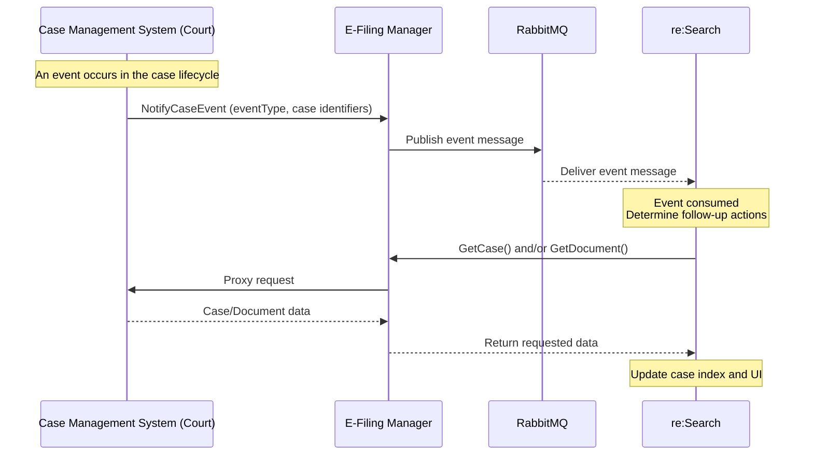
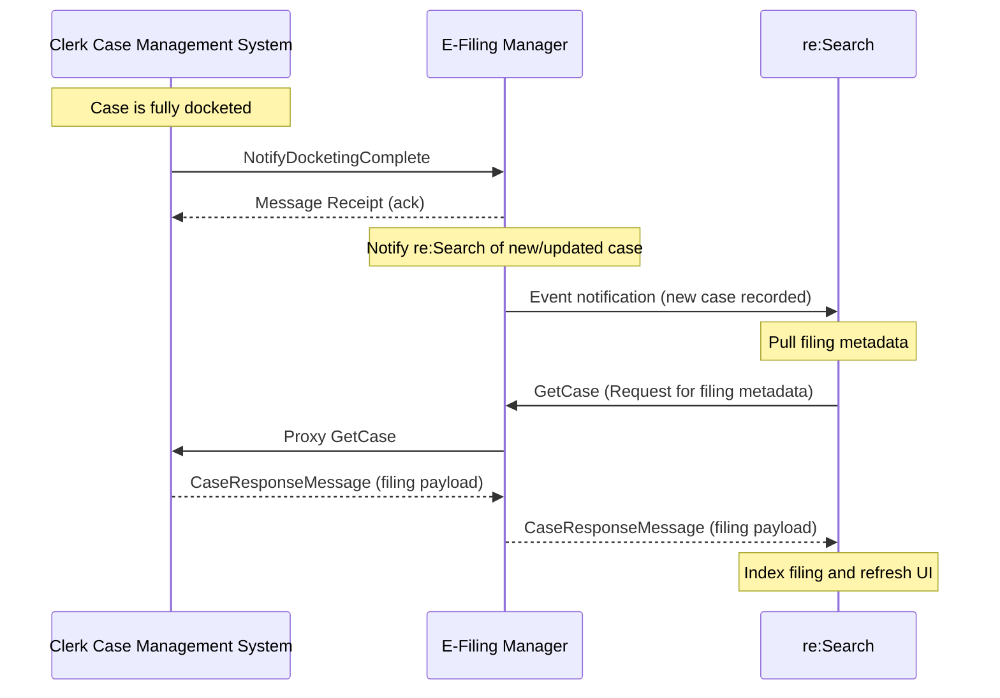
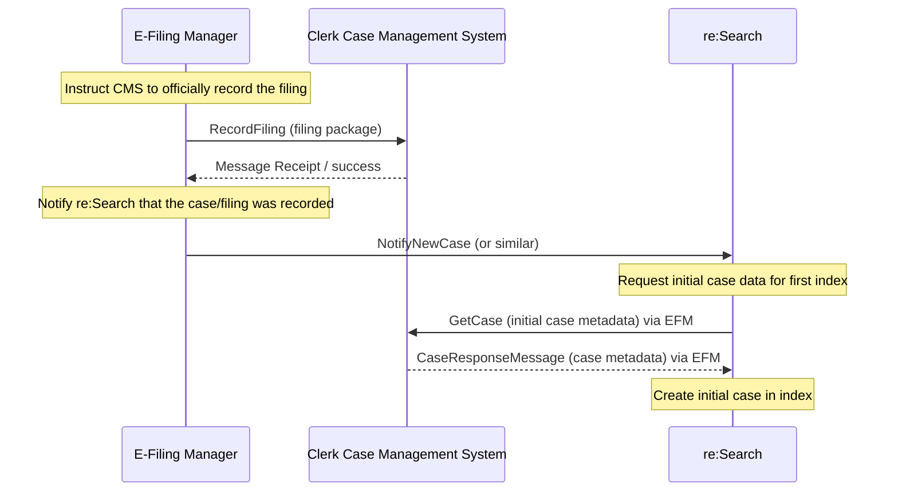

# GetCase – re:Search Integration API

`GetCase` is the authoritative API that **re:Search** uses to retrieve the full case record from a CMS.  
Everything shown in the re:Search UI—parties, filings, docket entries, documents, security, events—comes directly from the `GetCaseResponse`.

re:Search calls this API after every:

- `NotifyCaseEvent`
- `RecordFiling` → `NotifyDocketingComplete`
- Internal reconciliation or refresh job
- Certain user-driven actions (varies by environment)

Because GetCase drives all indexing and UI behavior, CMS vendors **must** return a complete and accurate case payload on every call.

---

## Purpose

GetCase provides re:Search with:

- Case header metadata  
- Parties & attorneys  
- Filing events and docket history  
- Document metadata (IDs, security, page count, etc.)  
- Case- and document-level security  
- Status, disposition, and reassignment  
- All updates associated with a NotifyCaseEvent  

The `GetCaseResponse` is the **single source of truth** for how the case appears in re:Search.

---

## Transport & Protocol

| Property     | Value |
|--------------|--------|
| Direction    | **re:Search → CMS** |
| Protocol     | SOAP 1.2 over HTTPS |
| Security     | Mutual TLS (mTLS) |
| Schema       | OASIS ECF 4.x CaseQueryResponseMessage |
| Messages     | `GetCaseRequest` / `GetCaseResponse` |

SOAP header rules:  
➡️ `../../common/common-headers-and-auth.md`

---

## When re:Search Calls GetCase

re:Search triggers GetCase when:

1. A `NotifyCaseEvent` arrives  
2. A filing is docketed (after `NotifyDocketingComplete`)  
3. A new case is created  
4. A user action requires updated information  
5. Internal reconciliation jobs detect incomplete or stale data  

The CMS must **always return the full case**, not partial updates.

---

## Required & Expected Fields

Below is a concise summary.  
A complete ruleset is in the Behavior Guide.

---

### Case Header

| Element | Requirement | Purpose |
|--------|-------------|---------|
| `ecf:CaseTrackingID` | **REQUIRED** | Primary case identifier |
| `ecf:CaseTitleText` | EXPECTED | Display in UI |
| `ecf:CaseCategoryText` | EXPECTED | Civil / Criminal / etc. |
| `ecf:CaseTypeText` | EXPECTED | Sub-classification |
| `ecf:CaseSubTypeText` | NEW / EXPECTED | Better filtering/search |
| `tyler:CaseSecurity` | **REQUIRED** | Case visibility |

---

### Filing & Event Data

| Element | Requirement | Purpose |
|---------|-------------|---------|
| `ecf:ActivityDate/nc:DateTime` | **REQUIRED** | Filing timeline ordering |
| `j:RegisterActionDescriptionText` | EXPECTED | Filing description |
| `ecf:FilingAttorneyID` | EXPECTED | Party/attorney linking |
| `ecf:FilingPartyID` | EXPECTED | Filing association |
| `ecf:ActivityStatus` | NEW / EXPECTED | UI messaging |

---

### Document Metadata

| Element | Requirement | Purpose |
|---------|-------------|---------|
| `nc:IdentificationID` | **REQUIRED** | CMSID for GetDocument |
| `nc:DocumentDescriptionText` | EXPECTED | Document label |
| `nc:DocumentPostDate/nc:DateTime` | EXPECTED | Sorting in UI |
| `nc:BinaryLocationURI` | EXPECTED | Handle/URL |
| `tyler:PageCount` | **REQUIRED** | Document indexing + UI |
| `nc:BinarySizeValue` | EXPECTED | Metadata for UI |
| `nc:BinaryCategoryText` | EXPECTED | LEAD/ATTACHMENT/EXHIBIT |

---

### Document Attachment Identification

| Element | Requirement | Purpose |
|---------|-------------|---------|
| `tyler:DocumentAttachmentReference` | REQUIRED | Reference to `structures:id` |
| `tyler:CMSID` | REQUIRED | Authoritative ID |
| `tyler:DocumentSecurity` | REQUIRED | Document visibility |

---

### Civil-Specific Metadata (Optional but Recommended)

| Element | Notes |
|---------|-------|
| `tyler:AmountInControversy` | Used when civil extraction enabled |
| `tyler:ClassActionIndicator` | — |
| `tyler:JuryDemandIndicator` | — |
| `tyler:ReliefTypeCode` | — |

---

## High-Level Workflow

### NotifyCaseEvent Trigger (ECF mode)

---
### NotifyDocketingComplete Trigger (ECF mode)

---
### RecordFiling Trigger (ECF mode)

---

## Critical Rules (Must Be Followed)

1. **EventType controls which XML blocks re:Search processes.**  
   Example: If `eventType=CaseParty`, re:Search only reads party blocks.

2. **GetCaseResponse must ALWAYS be complete.**  
   Partial responses cause data loss in re:Search.

3. **ActivityDate is REQUIRED**  
   Used to order filings and timeline events.

4. **PageCount is REQUIRED**  
   Used for document indexing and UI behavior.

5. **Do NOT embed binaries**  
   Only metadata + URI/handle should be returned.

6. **Exact security enumerations must be used**  
   - `PublicFilingPublicView`  
   - `ConfidentialFilingRestrictedView`  
   - `Sealed`  
   (Examples only)

More rules:  
➡️ **[behavior-guide.md](./behavior-guide.md)**

---

## Example Files

All example files (filenames only) are in:

| Example | File |
|---------|------|
| Annotated GetCase Request | [examples/getcase-request-annotated](./examples/getcase-request-annotated) |
| Parties-Only Request | [examples/getcase-request-partys](./examples/getcase-request-partys) |
| Parties + Documents Request | [examples/getcase-request-withpartiesanddocuments](./examples/getcase-request-withpartiesanddocuments) |
| Annotated GetCase Response | [examples/getcase-response-annotated](./examples/getcase-response-annotated) |

---

## Related API Pages

| API | Link | Purpose |
|------|------|---------|
| **RecordFiling** | [../recordfiling/README.md](../recordfiling/README.md) | Submit filings to CMS |
| **NotifyDocketingComplete** | [../notifydocketingcomplete/README.md](../notifydocketingcomplete/README.md) | Docket acceptance |
| **NotifyCaseEvent** | [../notifycaseevent/README.md](../notifycaseevent/README.md) | CMS-originated updates |
| **GetDocument** | [../getdocument/README.md](../getdocument/README.md) | Document retrieval |

---

Back to API Reference Index:  
➡️ [../README.md](../README.md)