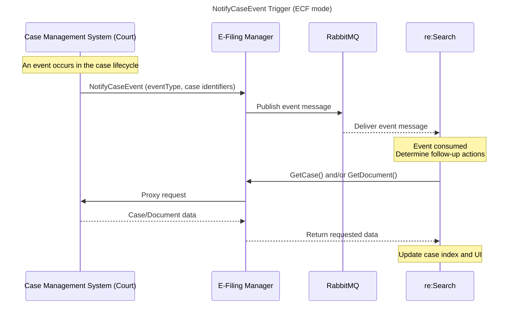
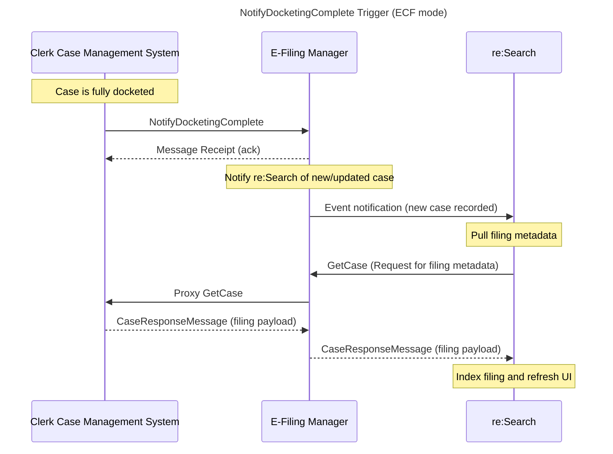
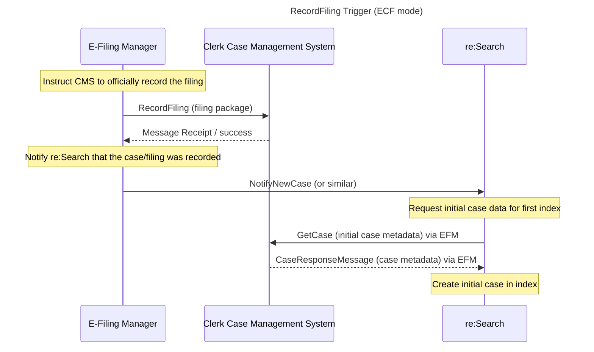

# GetCase – re:Search Integration API

Version: 3.4.x  
Audience: Technical  
Owner: BIS – Bryce Beltran  
Last Updated: 2025-11-12  

`GetCase` is the primary API used by re:Search to retrieve the authoritative case record from a CMS.  
It is called after event-driven messages (NotifyCaseEvent, RecordFiling, NotifyDocketingComplete) or whenever re:Search requires a refreshed view of case-level data.

This API is central to maintaining accurate and real-time case visibility in re:Search.

---

## Purpose

The GetCase API returns a **complete case snapshot**, including:

- Case metadata (tracking ID, style, type, status)
- Filings and docket entries
- Parties and associated attorneys
- Case-level security and document-level security
- Document metadata (not binaries)
- Judge/court assignment
- Case disposition changes

All indexing inside re:Search is based on this authoritative GetCase response.

---

## Transport and Protocol

| Property | Value |
|----------|-------|
| Direction | **re:Search → CMS** |
| Protocol | SOAP 1.2 over HTTPS |
| Security | Mutual TLS (mTLS) |
| Schema Standard | OASIS ECF 4.x |
| Response Type | `GetCaseResponseMessage` |

SOAP headers follow OASIS ECF conventions and Tyler extensions.  
See: `../common-headers-and-auth.md`

---

## When re:Search Calls GetCase

re:Search calls GetCase in these scenarios:

- After receiving a `NotifyCaseEvent`
- After receiving EFM-driven messages (RecordFiling, NotifyDocketingComplete)
- When correlating filings to cases
- When resolving discrepancies in indexed data
- During ingestion retries or fallback processing
- When a user attempts to view a case with incomplete/missing indexed fields

---

## High-Level Workflow

---

### Steps

1. **Trigger Occurs**  
   EventType, filing activity, docket activity, or CMS-side metadata change occurs.

2. **re:Search Issues GetCase**  
   A full case retrieval request is sent to the CMS.

3. **CMS Returns Full Case Snapshot**  
   CMS includes all required case elements, including filings, parties, security, etc.

4. **re:Search Validates the Response**  
   Schema validation, identifier consistency, and structural completeness are checked.

5. **Case Is Parsed & Indexed**  
   re:Search updates its search index and case display model.

---

## Required Response Elements (Full Case Snapshot Required)

CMS partners must always return a **complete GetCaseResponse**, not partial updates.

### Required Nodes

| Element | Description |
|---------|-------------|
| `Case` | Root case node (required) |
| `CaseTrackingID` | Primary identifier linking all filings and updates |
| `CaseType`, `CaseCategory`, `CaseStyle` | Core descriptors |
| `CaseStatus`, `CaseDisposition` | Status metadata |
| `CaseSecurity` | Case-level visibility rules |
| `Participants` | All parties + attorneys |
| `DocketEntries` | Chronological activity |
| `Filings` | Filings and pleadings attached to the case |
| `DocumentMetadata` | Metadata for documents referenced by filings |

The following *must always* appear:

- Every participant
- Every attorney tied to a participant
- Every active docket entry
- Every filing (including those not from e-filing)
- Every document metadata node

re:Search does **not** support partial payloads.

---

## How re:Search Uses GetCase Data

re:Search uses GetCase to:

- Update the search index  
- Display case details in UI  
- Synchronize filings and docket information  
- Reflect party and attorney changes  
- Apply security controls (case & document)  
- Resolve case-level discrepancies  
- Determine whether documents should display or remain restricted  

Each portion of the GetCaseResponse maps to a dedicated indexing subsystem.

---

## Behavior Differences: ECF Mode vs. Batch Mode

### ECF Mode (Real-Time)

- re:Search requests data from CMS on-demand  
- CMS must respond immediately with the full case record  
- Data is used immediately to refresh the index  
- CMS controls internal caching / live retrieval  
- Document binaries are retrieved separately via `GetDocument`

### Batch Mode (File-Based)

- GetCase is **not used for ingestion**  
- Instead, the CMS provides JSONL case snapshots through S3  
- re:Search ingests case, party, filing, and docket data from batch files  
- GetCase is only used for fallback scenarios or optional document retrieval  
- Document binaries may still be fetched via GetDocument (optional)

---

## Relationship Between GetCase and NotifyCaseEvent

| EventType | Expected GetCase Data | Processing Behavior |
|-----------|------------------------|----------------------|
| `CaseFiling` | Filings, docket entries, document metadata | Filing/docket blocks are scanned |
| `CaseSecurity` | CaseSecurity block | Case-level security updated |
| `CaseParty` | Party roster and attorney associations | Party blocks scanned |
| `CasePartyAttorney` | Attorney associations | Attorney sections scanned |
| `CaseReassigned` | Judge/court/location nodes | Reassignment applied |
| `CaseDisposition` | CaseDisposition data | Disposition updated |
| `CaseDelete` | Case removal flag | Case removed/unavailable |
| `CaseExpunge` | Expungement flags | Restricted display applied |

**Critical Rule:**  
re:Search only processes the portion of the GetCaseResponse that corresponds to the EventType declared in the NotifyCaseEvent.

All unrelated elements are ignored.

---

## Validation Requirements

### re:Search Requires:

- Schema-valid, fully formed XML  
- Consistent CaseTrackingID across all objects  
- DocketEntry IDs matching the CMS’ canonical IDs  
- Sorted docket entries (ascending or descending, consistent per CMS)  
- Valid security values (`Public`, `Sealed`, `Confidential`)  
- Case-sensitive attribute values  
- Every document referenced by a Filing must be present in DocumentMetadata

### re:Search Rejects:

- Missing or null CaseTrackingID  
- Partial case payloads  
- Empty or missing required nodes  
- Mismatched identifiers (Filing ID, Docket ID)  
- Unsupported enumerations  
- Incorrect casing (e.g., `SEALED` instead of `Sealed`)

---

## Common Vendor Mistakes

| Mistake | Result |
|---------|--------|
| Returning partial case records | Index gaps; missing filings/parties |
| Sending filings but not document metadata | Missing or undeclared documents |
| Returning empty party lists | UI hides all parties |
| Returning document metadata without IDs | Documents become unretrievable |
| Using wrong casing for security values | Security unchanged |
| Missing parent/child relationships | Broken index mappings |

---

## Error Handling

If the GetCaseResponse fails validation:

- re:Search logs XML validation errors  
- Indexing for the case is skipped  
- Vendor integration teams may see ingestion issues in CMS Integration Tool  
- User-facing UI may show stale or missing case data  

Error categories include:

- Schema validation errors  
- Missing required fields  
- Identifier mismatches  
- Unsupported values  
- Empty node sets  
- Transport/mTLS issues  

Reference: `../error-codes.md`

---

## Related API Reference Pages

Example XML files are located in the following directory:

| API | Path | Purpose |
|------|------|---------|
| **NotifyCaseEvent** | [../notify-case-event/index.md](../notify-case-event/index.md) | Triggers GetCase after case activity occurs. |
| **RecordFiling** | [../record-filing/index.md](../record-filing/index.md) | Provides filing packages from EFM to CMS. |
| **NotifyDocketingComplete** | [../notify-docketing-complete/index.md](../notify-docketing-complete/index.md) | Notifies that a filing has been docketed. |
| **GetDocument** | [../get-document/index.md](../get-document/index.md) | Retrieves document binaries. |

